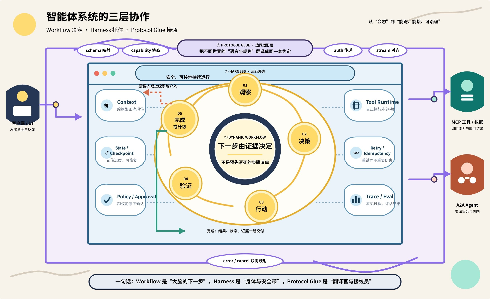
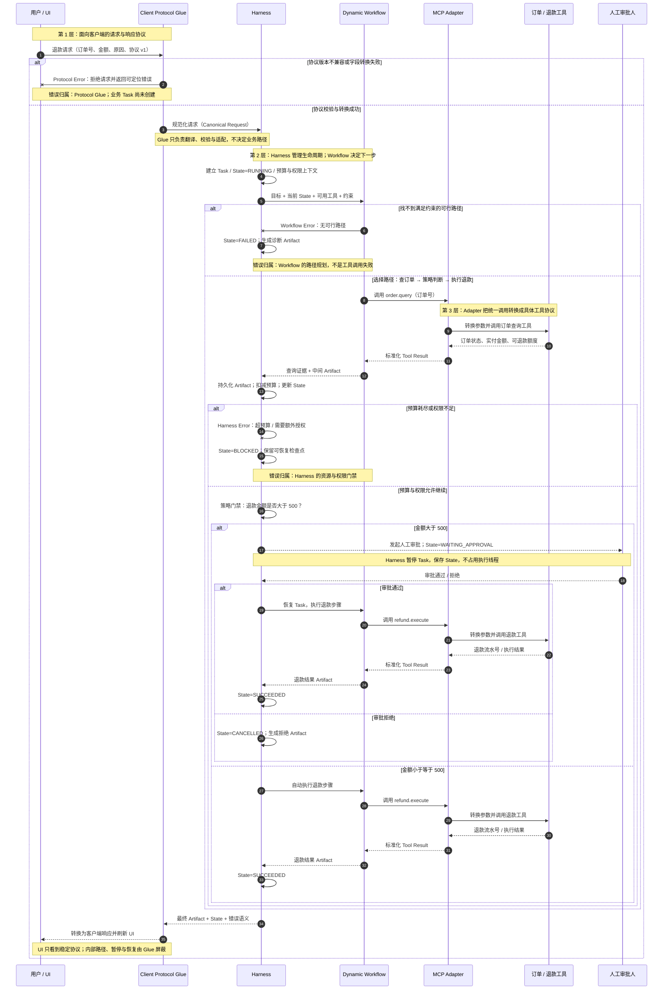

# Dynamic Workflow、Harness 与 Protocol Glue：把 Agent 从“会做事”变成“可运行系统”

> 来源：[飞书原文](https://bytedance.sg.larkoffice.com/docx/IkHddO3XcoegNIxwmIElHBhJgwb) · revision 15 · 转换日期 2026-07-30

上一篇《从 Vibe Coding 到 Agentic Engineering》讲到：**Agent = Model + Harness**。这篇继续向下拆一层，回答三个最容易混在一起的问题：Agent 为什么能临场改变步骤？是谁让它安全、连续、可观察地运行？不同工具、Agent 和客户端又如何互相理解？

> **先记住唯一一张心智地图：**`Dynamic Workflow` 决定“下一步做什么”；`Harness` 保证“这件事如何可靠地持续做”；`Protocol Glue` 解决“不同系统如何接得上、说得通”。

读完后，你应该能做到三件事：用自己的话解释三个概念；看懂一个 Agent 系统的运行链路；从零搭出一个带动态路由、权限门禁、工具协议和运行记录的最小系统。

## 1. 先用一家餐厅理解三个概念

假设你经营一家餐厅。客人说：“我对花生过敏，只有二十分钟，请给我一份热的晚餐。”这不是一个简单的固定菜单请求。厨房需要先理解限制，再检查食材和排队情况，必要时换菜，最后确认没有过敏原。

| 概念 | 餐厅里的对应物 | 在 Agent 系统里负责什么 |
|-|-|-|
| **Dynamic Workflow** | 主厨根据过敏、时间和库存，临场决定下一步 | 根据当前状态选择步骤、工具、分支和停止条件 |
| **Harness** | 整套厨房运行制度：工位、卫生、权限、叫号、复核、事故处理 | 承载模型循环、上下文、工具、状态、权限、重试、日志与评估 |
| **Protocol Glue** | 点单格式、后厨小票、外卖平台接口与翻译员 | 在不同系统之间转换消息、能力、状态、错误与流式事件 |

最容易犯的错误，是把三者都叫“工作流”。但它们回答的是三个不同层面的问题：**决策层**决定路径，**运行层**提供可靠环境，**连接层**处理互操作。

### 1.1 一张图看懂三层关系



可以把模型想成主厨的大脑。Dynamic Workflow 是主厨的现场决策；Harness 是厨房；Protocol Glue 是厨房与点单台、仓库、支付系统之间的标准接口和转换层。只有“大脑”而没有后两者，模型最多能提出建议，不能稳定完成真实任务。

## 2. Dynamic Workflow：运行时才决定完整路径

**先说严谨边界：**Dynamic Workflow 不是像 MCP 那样有统一版本号和规范文本的专有协议。本文把它作为一个工程工作定义：**步骤不在运行前全部写死，而是由模型或策略根据当前状态，在允许的边界内选择下一步。**

Anthropic 将预定义代码路径称为 Workflow，将由模型动态决定过程和工具使用的系统称为 Agent。实际生产系统往往位于两者之间：工具集合、权限和终止规则由代码固定，而路径、顺序和是否重试由模型动态决定。这种“有边界的动态性”，就是本文所说的 Dynamic Workflow。

| 模式 | 谁决定步骤 | 优点 | 适用场景 |
|-|-|-|-|
| **固定 Workflow** | 程序员提前写死 A→B→C | 可预测、易测试、成本稳定 | 报销审批、固定 ETL、明确 SOP |
| **Dynamic Workflow** | 模型在允许的图中选择下一步 | 能处理信息缺失、异常和开放任务 | 客服、研究、Coding Agent、复杂排障 |
| **完全自治** | 模型还能扩展工具与目标 | 灵活性最高 | 高风险，通常只适合受控实验 |

一个最小的动态循环只有五步：**观察状态 → 决定下一动作 → 执行动作 → 验证结果 → 完成、重试或升级给人**。这里的“动态”不是随机乱走，而是每一步都读取新证据，再在受限动作空间里做选择。

### 2.1 用退款请求看动态分支

用户说“帮我退掉昨天的订单”，系统可能遇到四种情况：没有订单号，需要追问；订单已发货，需要读取退货政策；退款金额超过阈值，需要人工审批；支付接口超时，需要查询幂等键而不是重复扣回。运行前无法知道会走哪条支路，但每条支路都必须在规则允许范围内。

因此，一个生产可用的 Dynamic Workflow 至少要有：明确的状态对象、有限的动作集合、每个动作的前置条件、预算或最大步数、成功判定、失败分类，以及人工升级出口。

## 3. Harness：把一次模型调用变成可工作的 Agent

模型本身更像一个“给定上下文，生成下一段输出”的函数。Harness 是包围模型的运行系统：它持续组装上下文、调用模型、解析动作、执行工具、把结果写回状态，再决定是否继续。OpenAI 将 Codex Harness 描述为支撑各种 Codex 体验的 Agent Loop 与逻辑；Anthropic 也强调，评估 Agent 时，实际评估的是模型与 Harness 的组合。

| Harness 组件 | 它解决的问题 | 最小实现 |
|-|-|-|
| **Agent Loop** | 模型何时思考、行动、观察、停止 | 带最大步数的循环 |
| **Context Builder** | 本轮应该给模型哪些规则、记忆与证据 | 系统规则 + 状态摘要 + 最近工具结果 |
| **Tool Runtime** | 工具发现、参数校验、调用与结果规范化 | 工具注册表 + Schema 校验 |
| **State / Checkpoint** | 中断后如何继续，长任务如何不丢状态 | 持久化 task_id、step、artifacts |
| **Safety / Permission** | 哪些动作允许自动执行，哪些必须确认 | 读写分级 + 审批门禁 + Sandbox |
| **Reliability** | 超时、重试、重复请求和部分失败 | 超时、退避、幂等键、补偿动作 |
| **Observability** | 系统为什么成功、失败、昂贵或缓慢 | 结构化事件、Trace、成本和结果评估 |

### 3.1 Agent Harness 与 Eval Harness 不要混淆

**Agent Harness** 让模型能够行动；**Eval Harness** 批量运行测试任务、记录轨迹、评分并汇总结果。前者像汽车本身，后者像测试场和测量设备。Eval Harness 可以启动 Agent Harness，但不能替代它。

### 3.2 Harness 不是“大 Prompt”

很多人会把 Harness 理解成“更长、更严格的 Prompt”，因为两者表面上都在规定模型应该怎么做。真正的区别不在字数，而在**规则的执行权交给谁**：Prompt 把规则告诉模型，希望模型理解并记住；Harness 把规则交给程序，即使模型忘记、误解或试图跳过，系统仍会按照同一套机制处理。

继续用退款举例。Prompt 可以写：“金额超过 500 元必须先让用户确认。”这是一张贴在工位上的提醒纸，模型有可能遵守，也有可能在长上下文中漏掉。Harness 则会在真正调用退款工具之前检查金额和审批状态：条件不满足时拒绝执行，只返回 `approval_required`。模型可以提出退款请求，却没有越过门禁的权力。

| 对象 | 它是什么 | 模型忘记规则时 | 典型内容 |
|-|-|-|-|
| **Prompt** | 一次任务中的自然语言要求 | 可能被忽略或误解 | 目标、背景、语气、输出要求 |
| **Skill** | 可复用的专业说明书，可以附带脚本、模板和参考资料 | 纯文字规则仍可能被跳过；脚本只在被调用时生效 | 领域流程、工具用法、校验器、转换脚本 |
| **Harness** | 包围模型的执行环境和控制循环 | 程序仍可阻断、改道、重试或等待审批 | 状态机、权限、工具白名单、校验、超时、重试、日志 |

**Skill 可以有 Harness 吗？**可以，但要说清层次。一个 Skill 可以附带确定性脚本或校验器，这些是 Harness 的组件，也可以称为“局部微型 Harness”。然而，如果只是 `SKILL.md` 提醒模型“记得运行校验脚本”，模型仍然可以不运行，它就还不是不可绕过的门禁。只有外层运行时强制调用校验器，并根据返回结果决定“继续、阻断、重试或等待人工”，这条规则才真正进入 Harness。

因此，**Skill 不等于 Harness**。Skill 更像“专业操作手册＋随附工具箱”；Harness 更像“现场管理系统”。操作手册可以携带测温仪，但只有出餐口强制读取温度、不合格就锁住出餐流程时，测温才成为真正的系统门禁。

还要修正一句容易产生误会的话：“Prompt 只能提出要求，Harness 可以确定性地执行要求。”这里的“确定性”主要指**流程和约束可以被稳定执行**，不代表 Harness 能保证所有业务判断都正确。它可以保证未经审批不退款、输出不符合 Schema 就拒绝、工具超时后按规则重试；但它不能凭空保证模型选择了最正确的数据表、理解了最准确的业务口径，除非这些判断也有可执行、可验证的规则。

**最简单的判断方法是问：如果模型忘了这条规则，系统还能挡住错误吗？**如果答案是否定的，它主要还是 Prompt 或 Skill 指令；如果答案是肯定的，并且失败会改变程序状态、阻止下一步，它才属于 Harness。凡是“不允许忘记”的规则，都应尽量从语言提醒升级为可执行约束。

## 4. Protocol Glue：让边界两侧互相理解

Protocol 定义双方都遵守的“语言”；Glue 负责把你系统内部的对象和事件，翻译成这种语言，再把响应翻译回来。它通常包含 Schema 映射、能力协商、身份认证、流式事件转换、错误码归一化、取消与超时、会话和任务 ID 关联。

Protocol Glue 不应该替 Agent 做业务判断。比如“金额超过 500 元走审批”属于 Workflow 或 Harness Policy；“把内部 needs_human 转成外部协议的状态事件”才属于 Glue。把业务逻辑塞进 Adapter，会让每换一个协议就复制一遍规则。

| 连接方向 | 适合的协议/接口 | 传递的核心对象 | Glue 的工作 |
|-|-|-|-|
| **客户端 ↔ Harness** | JSON-RPC、App Server API | 会话、请求、进度、审批、Diff | 把内部事件变成稳定的 UI 事件 |
| **Harness ↔ 工具** | MCP、Function Calling、REST | Tools、Resources、Prompts、结果 | 能力发现、参数映射、认证和错误处理 |
| **Agent ↔ Agent** | A2A | Task、Message、Artifact、状态更新 | 任务生命周期、流式事件与产物映射 |

MCP 的基础协议使用 JSON-RPC，并定义初始化、能力协商、工具与资源等边界；A2A 把独立 Agent 之间的交互抽象为有生命周期的 Task、用于沟通的 Message 和真正交付结果的 Artifact。它们解决的不是同一个方向：**MCP 更像 Agent 接工具的插座，A2A 更像 Agent 之间的快递与工单系统。**

## 5. 一次请求如何穿过三层



仍以退款为例：客户端发来请求后，Protocol Glue 将消息转换成 Harness 的统一输入；Harness 创建任务状态并组装上下文；Dynamic Workflow 选择“查询订单”；Harness 通过 MCP Adapter 调用订单工具；结果写回状态后，Workflow 再决定读取政策、请求审批或执行退款；最终产物与状态由 Glue 转换成客户端可消费的响应。

注意两个关键点。第一，**同一请求会多次穿过决策循环**，不是一次模型调用完成全部工作。第二，**每层都有独立失败语义**：Workflow 可能“无可行路径”，Harness 可能“超过预算”，Protocol Glue 可能“版本不兼容”。只有把错误分层，排障才不会变成一句模糊的“Agent 不聪明”。

## 6. 从零搭一个最小可用系统

不要一开始就上多 Agent、复杂图编排和十几个协议。先做一个单 Agent、固定工具集、动态步骤的最小闭环。

### 6.1 第一步：先定义状态和终止条件

```typescript
type TaskState = {
  taskId: string
  goal: string
  facts: Record<string, unknown>
  artifacts: Array<Artifact>
  step: number
  status: "running" | "waiting_approval" | "completed" | "failed"
}
```

如果没有显式状态，所有信息只能藏在对话文本里：无法稳定恢复、无法判断重复调用，也无法让日志、审批和评估引用同一事实。

### 6.2 第二步：用协议适配器统一工具

```typescript
interface ToolAdapter {
  listCapabilities(): Promise<ToolSchema[]>
  call(name: string, args: unknown, ctx: CallContext): Promise<ToolResult>
  cancel(callId: string): Promise<void>
}
```

本地函数、REST API 或 MCP Server 都可以实现这个接口。Workflow 不需要知道工具来自哪里，只依赖统一能力描述和结果结构。

### 6.3 第三步：写出 Harness Loop

```typescript
for (let i = 0; i < MAX_STEPS; i++) {
  const context = buildContext(state, policy, recentEvents)
  const decision = await model.decide(context, await tools.listCapabilities())

  const gate = policy.check(decision, state)
  if (gate.requiresApproval) return checkpoint(state, "waiting_approval")
  if (!gate.allowed) return fail(state, gate.reason)

  const result = await tools.call(decision.tool, decision.args, callContext)
  trace.append({ decision, result })
  state = reduce(state, decision, result)

  if (isDone(state)) return complete(state)
}
return fail(state, "step_budget_exceeded")
```

这段代码里，`model.decide` 是 Dynamic Workflow 的决策点；整个循环、Policy、Checkpoint 和 Trace 属于 Harness；`tools.call` 背后的转换属于 Protocol Glue。

### 6.4 第四步：用三个测试证明它真的可用

1. **正常路径：**有订单号、符合政策，一次退款成功并生成回执。
2. **风险路径：**金额超过阈值，系统停在 `waiting_approval`，绝不直接执行。
3. **故障路径：**支付接口超时，系统用同一幂等键查询状态，不重复退款。

如果这三条还没有跑通，增加更多 Agent 或更强模型只会放大不可控性。

## 7. 常见误区：看起来高级，实际很脆

| 误区 | 为什么会出问题 | 更好的做法 |
|-|-|-|
| 把 Dynamic 当作“无限自主” | 没有动作边界、预算和停止条件 | 固定能力边界，动态选择路径 |
| 把 Harness 当成 Prompt 模板 | 语言要求不能替代权限、幂等和恢复机制 | 把硬规则写成代码门禁 |
| 把业务规则塞进 Protocol Adapter | 换协议就复制逻辑，错误难归因 | Adapter 只做语义保持的转换 |
| 所有工具都返回一段文本 | 状态不可校验，后续只能猜 | 返回结构化结果、错误类型和证据 |
| 只有最终答案，没有运行事件 | 无法知道错在决策、工具还是连接 | 记录状态、动作、结果、门禁与成本 |
| 一开始就做 Multi-Agent | 把单个循环的问题变成分布式问题 | 先证明单 Agent 最小闭环 |

## 8. 什么时候该用哪一层

**只需要固定 Workflow：**步骤稳定、输入结构化、每一步都有确定规则。普通代码和状态机通常更便宜、更可靠。

**需要 Dynamic Workflow：**任务路径依赖运行时发现的信息，异常类型多，或需要在多种工具之间做语义判断。此时让模型决定路径，但把动作空间和风险边界固定住。

**必须投资 Harness：**只要 Agent 会执行外部动作、运行时间较长、需要恢复，或结果要进入生产，就不能只靠演示脚本。

**需要 Protocol Glue：**当同一个 Harness 要接多个客户端、多个工具提供方，或与独立 Agent 协作时。若系统只有一个本地函数，先写清晰接口即可，不必为了“标准化”提前引入协议。

## 延伸阅读

- [Anthropic｜Building Effective AI Agents](https://www.anthropic.com/engineering/building-effective-agents)：Workflow 与 Agent 的经典边界，以及常见编排模式。
- [OpenAI｜Unlocking the Codex harness: how we built the App Server](https://openai.com/index/unlocking-the-codex-harness/)：Harness、长生命周期进程、双向 JSON-RPC 与客户端事件转换。
- [Anthropic｜Demystifying evals for AI agents](https://www.anthropic.com/engineering/demystifying-evals-for-ai-agents)：Agent Harness 与 Eval Harness 的区分。
- [Model Context Protocol｜Base Protocol](https://modelcontextprotocol.io/specification/2025-06-18/basic/index)：JSON-RPC、生命周期、能力协商和工具/资源边界。
- [A2A Protocol｜Core Concepts](https://a2a-protocol.org/latest/topics/key-concepts/)：Task、Message、Artifact、流式更新与 Agent 间协作。

---

**最后再复述一遍：**模型提供推理能力；Dynamic Workflow 使用这份能力选择路径；Harness 把选择变成安全、可恢复、可观察的执行；Protocol Glue 让这套执行系统能与外部世界稳定互操作。真正可复利的，不是某次回答，而是这三层共同形成的运行系统。
