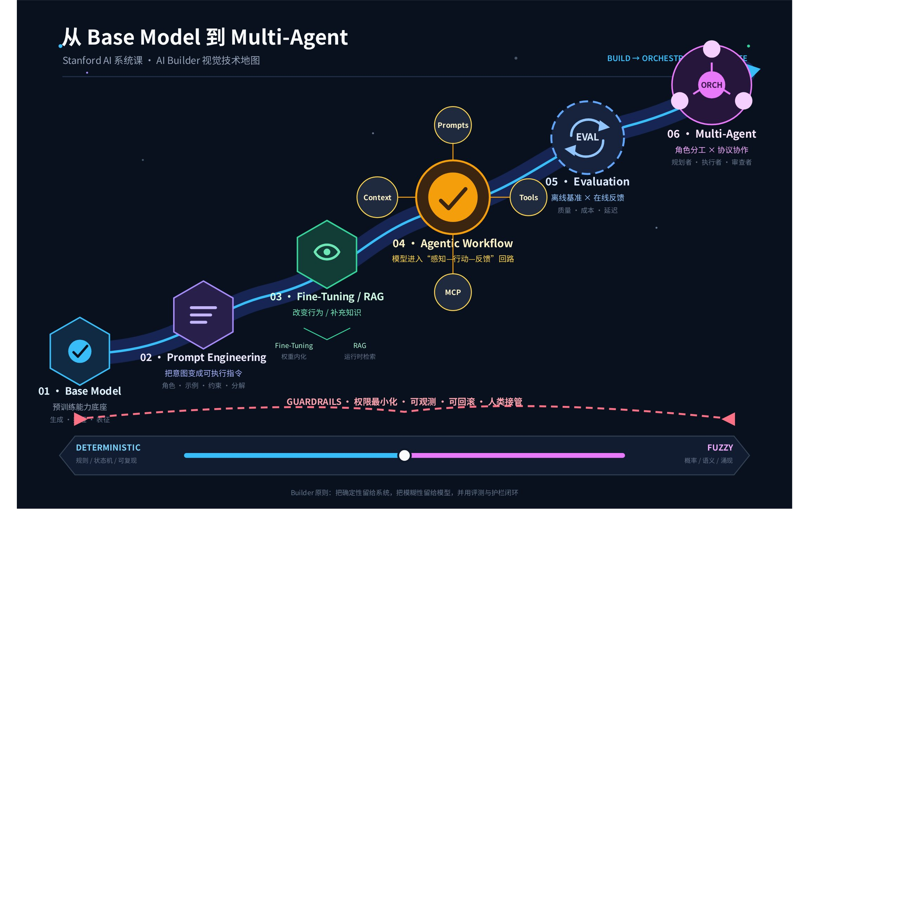
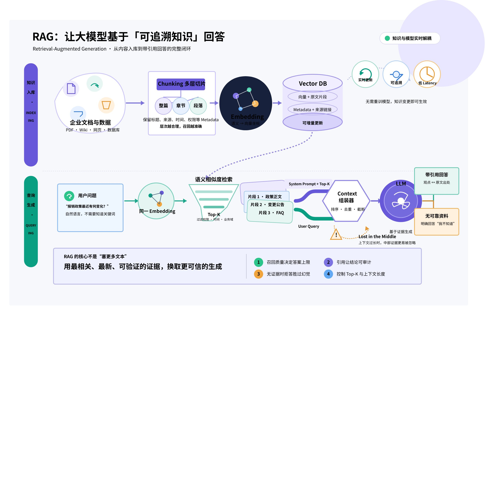
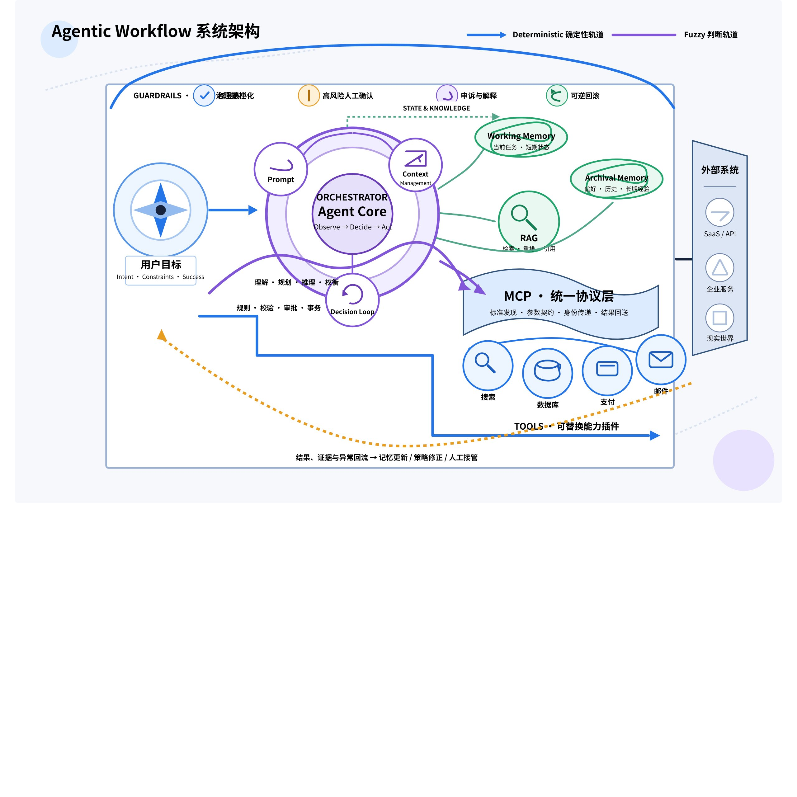
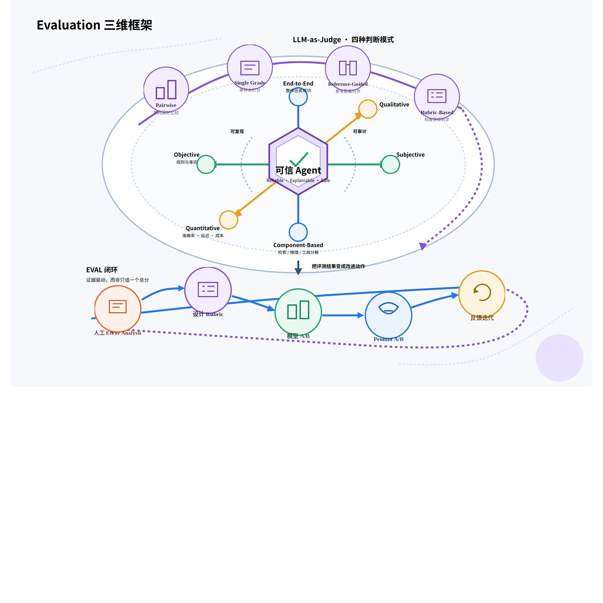
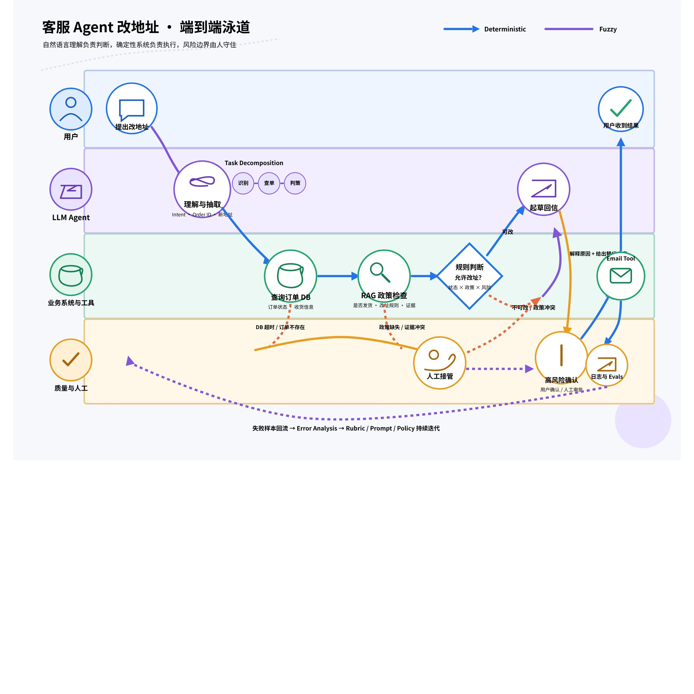
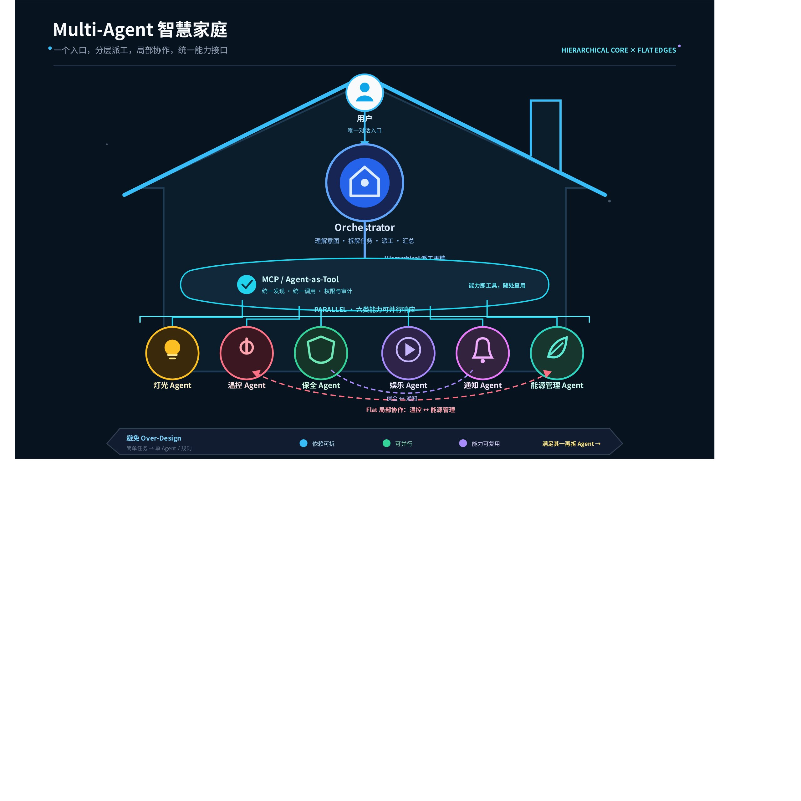

# 从 LLM 到 Agentic Workflow

> 来源：[飞书原文](https://bytedance.sg.larkoffice.com/docx/N3emdqhVNohtYZx2yBolJqhsgse)
> 转换日期：2026-07-15

> 💡 **核心结论：**真正的 AI Builder 不是不断追逐更强模型，而是知道何时使用 Prompt、RAG、Tool、Agent、Eval 和 Multi-Agent，并把确定性软件与模糊智能组合成可控系统。

## 一图读懂：从基础模型到 Multi-Agent

### 技术选择总览

| 层级 | 解决的问题 | 主要手段 | 优先判断 |
| --- | --- | --- | --- |
| **Base Model** | 通用语言、推理与生成 | GPT、Claude 等 | 模型升级只抬高起点，不等于业务系统升级 |
| **单模型增强** | 输出质量、领域知识、最新信息 | Prompt、Fine-Tuning、RAG | 优先低成本、可迁移、可观测方案 |
| **系统执行** | 多步骤任务与外部动作 | Agentic Workflow、Tools、Memory、MCP | 确定性的归确定性，模糊的加护栏 |
| **质量保障** | 定位错误、比较方案、控制风险 | Eval、LLM-as-Judge、人工复核 | 先人工理解错误，再自动化评估 |
| **并行与复用** | 缩短耗时、复用专用能力 | Multi-Agent、Orchestrator | 单 Agent 能解决就不要过度设计 |

## 01｜为什么单靠基础模型不够

### 横轴升级 vs 纵轴增强

#### 横轴：更换 Base Model

例如从 GPT-4 升级到 GPT-5。主要由 OpenAI、Anthropic 等模型公司推动，普通团队通常没有资金和能力训练自己的大型基础模型。

#### 纵轴：Augmenting LLM

在现有模型之上叠加 Prompt、RAG、Tools、Agent、Eval 等工程技术。Beyond LLM 课程和本视频主要讨论这条路线。

### 基础模型的四类限制

| 限制 | 具体表现 | 视频案例 | 工程启示 |
| --- | --- | --- | --- |
| **缺乏领域知识** | 不知道企业内部文件、产品规格和专有数据 | 自动化农业设备需要识别作物病害，但市场上没有对应数据集 | 需要 RAG、领域数据或少数情况下的 Fine-Tuning |
| **信息会落后** | 无法持续认识新词、新事件、新公司和网络用语 | 模型不可能每隔几个月重训一次 | 知识更新应与模型训练解耦 |
| **难以控制** | 同一 Prompt 多次执行可能产生不同结果 | 退款问题一次答可以、一次答不行，会带来生产风险 | 关键规则必须确定性执行，并加入权限与确认机制 |
| **长上下文退化** | Context Window 很大也可能找不到中间细节 | 把“Gary 午餐吃苹果”藏在一年会议记录中，模型可能答不出 | 超长上下文不能替代可靠检索与索引 |

早期 ChatGPT 没有联网和工具调用能力，本质上只是聪明的问答机器人，无法真正替用户完成一件事。做 AI 产品不能只等待下一个更强模型，而要在纵轴上设计工程系统。

## 02｜强化单一 LLM：Prompt、Fine-Tuning 与 RAG

### 三类手段的定位

| 手段 | 最适合解决 | 主要优势 | 主要代价 | 默认建议 |
| --- | --- | --- | --- | --- |
| **Prompt Engineering** | 任务说明、输出格式、工作步骤 | 成本最低、可迁移、迭代快 | 受上下文容量和模型能力限制 | 所有工程师都应掌握 |
| **Fine-Tuning** | 重复、高精度、特定 Domain 输出 | 可塑造稳定的领域行为 | 数据昂贵、易过拟合、时效差 | 能不做就不做 |
| **RAG** | 企业知识、最新信息、可追溯回答 | 知识可更新、检索高效、支持引用 | 依赖切片、索引与检索质量 | AI 产品的标准能力 |

### Prompt Engineering：不是职业噱头，而是基本功

Stanford 教授认为 Prompt Engineering 应成为每位工程师的基础能力，类似九九乘法表。一个好 Prompt 至少应交代：给谁看、产出格式、重点是什么。“总结这篇文章”信息不足；“把再生能源论文整理为五个要点，并聚焦政策含义”能明确读者、长度和关注点。

#### BCG 实验：AI 的边界与两种协作方式

| 发现 | 含义 | 实践判断 |
| --- | --- | --- |
| **The Jagged Frontier** | AI 能力边界呈锯齿状；有些任务显著加分，有些任务反而被拖累 | 不要把“模型很强”误解成“所有任务都可靠” |
| **Falling Asleep at the Wheel** | 在 AI 弱项上过度信任并直接交付，结果可能比不用 AI 更差 | 必须知道能力边界并保留人工判断 |
| **Centaur** | 分工委派型；给 AI 一个完整任务后让它独立执行 | 适合重复性高、流程明确的工作 |
| **Cyborg** | 高频协作型；人与模型逐句交流、持续校正 | 适合需要判断、创意和迭代的任务 |

#### Prompt Chaining：把黑盒拆成可测试流水线

Prompt Chaining 不等于 Chain of Thought。前者把复杂任务拆成多个独立 Prompt，并把上一步输出交给下一步；后者是要求模型逐步思考。以投诉回信为例，可以拆成“抽取诉求 → 生成大纲 → 写完整回信”。每一步都能独立测试和 Debug，也让流程具备 Observability。

### Fine-Tuning：四个默认反对理由

| 理由 | 说明 |
| --- | --- |
| **1｜数据成本** | 需要大量高质量、标注好的数据，普通团队难以承担。 |
| **2｜过拟合** | 特定任务变强的同时，可能损失 Base Model 原有的通用能力。 |
| **3｜时效性** | 微调两个月后，新一代 Base Model 可能直接超越微调版本。 |
| **4｜可替代性** | 很多效果可通过 Prompt 达成，且 Prompt 更容易迁移到新模型。 |

Fine-Tuning 仍适用于法律、科学等需要重复高精度输出的领域，或 Base Model 在特定 Domain 明显吃力的情形；但对大多数团队，投入产出比通常不理想。

### RAG：从问题到可追溯答案的完整链路

#### RAG 的核心步骤

1. 用 Embedding 模型把文档转成向量，存入 Vector Database。
2. 把用户问题转成同一向量空间中的表示。
3. 通过距离指标检索语义最接近的文档片段，而不是只做关键词匹配。
4. 把检索片段、System Prompt 与 User Query 组合后交给 LLM。
5. 要求模型只依据资料回答；没有答案就说不知道，并返回页码、章节、行号或链接供验证。

视频以药物副作用为例：即使问题说“副作用”、文档写“不良反应”，语义检索仍可能正确命中。长达 50 页的文件不应整体压成一个向量，而应使用 Chunking；更进阶的方法同时保存整篇、章节和段落级向量，先定位章节，再下钻到精确段落。

超长 Context 不会很快淘汰 RAG。每次提问都让模型重读整个 Google Drive，会带来难以接受的延迟和成本。搜索引擎同样依赖预建索引，而不是每次查询都重新爬遍互联网。RAG 的高效检索、实时更新和来源追溯仍具有长期价值。

## 03｜Agentic Workflow：从回答问题到完成任务

### Agentic Workflow 系统架构

“AI Agent”已经被泛化：一个长 Prompt 可以叫 Agent，复杂 Multi-Agent 系统也叫 Agent。吴恩达使用 Agentic Workflow 来精确描述：把提示词、外部工具、上下文、记忆和多步决策组合进结构化工作流程。

RAG 主要提供外部资料；Agent 会把 RAG 当作工具之一。用户提出退款时，Agent 可以检索政策、追问订单号、查询订单、确认退款并告知三到五个工作日的处理时间。RAG 是工具，Agent 是使用工具完成任务的系统。

### 传统软件 vs Agentic AI

| 面向 | 传统软件 | Agentic AI |
| --- | --- | --- |
| **数据** | JSON、数据库、表单；格式固定 | 自由文本、图片、音频；格式不固定 |
| **逻辑** | Deterministic；同一输入产生同一输出 | Fuzzy；概率性、上下文敏感 |
| **架构心态** | 精确控制每条路径 | Think like a manager：管理目标、权限与边界 |
| **测试** | 可重复、可穷举 | 迭代探索，无法覆盖所有情形 |

> 💡 **第一落地原则：**能用 Deterministic 方法解决的问题，就不要交给 LLM；剩余的 Fuzzy 部分才使用模型，并为错误设计人工申诉、确认、权限控制和回滚等护栏。

技能测评案例中，选择题、配对题和拖拽题有标准答案，应确定性计分；语音题或语音加编程题需要判断理解程度、表达清晰度和逻辑质量，只能使用 Fuzzy Scoring。由于 LLM 一定可能误判，系统提供 Appeal Feature，由真人复核。护栏不是让 AI 零错误，而是确保出错时有人接得住。

### Agent 的三个核心要素

| 要素 | 作用 | 关键内容 |
| --- | --- | --- |
| **Prompts** | 定义角色、任务和边界 | 能做什么、不能做什么、以什么标准完成 |
| **Context Management** | 在正确时间提供正确信息 | 对话历史、RAG 结果、压缩与丢弃策略 |
| **Tools** | 执行动作或查询数据 | 航班搜索、酒店预订、支付、CRM、数据库等 |

Memory 可分为 Working Memory 和 Archival Memory。前者高频、需要快速访问，例如用户名和本次目的地巴黎；后者低频、按需检索，例如过去五年的订房记录。

### 自主性的三层与风险

| 层级 | 步骤 | 工具 | 特点 | 建议 |
| --- | --- | --- | --- | --- |
| **Hardcoded Steps** | 固定 | 固定 | 安全、可预测，但僵硬 | 适合边界稳定的流程 |
| **Hardcoded Tools** | Agent 决定 | 固定 | 兼顾灵活性与可控性 | 推荐作为生产起点 |
| **Fully Autonomous** | Agent 决定 | 可自行创建 | 能力最强、风险最高 | 必须严格限制外部动作 |

视频用“Agent 错订 100 张机票”提醒：自主性越高，权限、确认机制、幂等和回滚越重要。

### MCP：统一连接工具与 Agent

传统方式要为每个 API 单独编写接入逻辑，并告诉模型每个接口的参数。MCP 在中间提供统一协议层，Agent 只与 MCP Server 通信，由它连接后端服务。它像通用插头，避免为不同插座携带大量转接头。进一步还可以把其他 Agent 当作工具调用，为 Agent-to-Agent Communication 和 Multi-Agent 奠定基础。

## 04｜Evaluation：生产级 Agent 的质量系统

### Eval 三维框架

| 维度 | 一端 | 另一端 | 为什么两端都要 |
| --- | --- | --- | --- |
| **评估范围** | End-to-End：用户是否满意 | Component-Based：哪一步出错 | 整体告诉你是否有问题，组件告诉你为什么 |
| **判断标准** | Objective：有明确对错 | Subjective：语气、同理心等 | 能自动验证的不要浪费人工；无标准答案的必须主观判断 |
| **证据形态** | Quantitative：成功率、延迟 | Qualitative：幻觉形态、困惑点 | 数字呈现规模，人工分析解释原因 |

### LLM-as-Judge 的四种方式

| 方式 | 说明 |
| --- | --- |
| **Pairwise** | 给两个答案，让 Judge 判断哪个更好。 |
| **Single-Answer Grading** | 针对单个答案直接打一到五分。 |
| **Reference-Guided Pairwise** | 增加标准答案，让比较更有依据。 |
| **Rubric-Based** | 明确五分、零分等评分规则，可与 Few-Shot Examples 组合。 |

### 一次主观 Eval 的标准闭环

1. **Error Analysis：**从约一千个会话抽二十个，人工阅读，发现回复过短、语气生硬、缺乏同理心等真实错误。
2. **设计 Eval：**把人工发现的问题转成礼貌度 Rubric，并使用 LLM-as-Judge。
3. **模型 A/B Test：**固定 Prompt，只替换 GPT、Opus 等底层模型。
4. **Prompt A/B Test：**固定模型，只修改 Prompt，例如从 travel agent 变为 helpful travel agent。

先人工理解问题，再设计自动化 Eval；模型和 Prompt 两个变量一次只改一个，否则无法判断差异来源。

## 05｜客服 Agent：从人类 SOP 到上线系统

### 客服改地址工作流

> 🔍 **正确起点：**先坐到客服旁边观察一到两天，理解人类真实工作流，再做 Task Decomposition。不是先写一个看起来很聪明的 Prompt。

| 阶段 | 子任务 | 采用能力 | 验证重点 |
| --- | --- | --- | --- |
| **1｜理解** | 抽取意图、Order ID、新地址 | LLM One-Shot | 字段准确率 |
| **2｜查询** | 查询客户与订单记录 | Custom Tool / MCP | API 错误率、数据一致性 |
| **3｜判断** | 检查是否发货、是否允许改址 | RAG + 确定性规则 | 政策遵守率 |
| **4｜生成** | 依据前序结果起草回信 | LLM | 正确性、语气、同理心 |
| **5｜执行** | 发送 Email | 受控 Email Tool | 确认、幂等、发送状态 |

### 完整 Eval 覆盖

**End-to-End：**最终回复是否正确、用户是否满意。**Component-Based：**抽取准确率、API 错误率、政策遵守率。**Objective：**Order ID 是否正确、是否违反规则。**Subjective：**是否礼貌、是否有同理心。**Quantitative：**改址成功率、延迟、退款正确率。**Qualitative：**幻觉位置、语气不一致、用户困惑点。

### 从零到上线的三步

| 步骤 | 说明 |
| --- | --- |
| **① 拆任务** | 把大任务分解为模型和工具能够逐个完成的小任务。 |
| **② 设计流程** | 判断每一步是 Fuzzy 还是 Deterministic，再选择 LLM、RAG 或 Tool。 |
| **③ 建立 Evals** | 持续验证系统稳定性、业务正确性与用户体验。 |

## 06｜Multi-Agent：何时需要，如何组织

### Multi-Agent 智慧家庭架构

### 引入理由与反对理由

#### 值得引入

- **并行处理：**搜索航班、寻找酒店和查询天气可以同时执行。
- **能力复用：**Design Agent 可以被营销和产品团队共同使用。

#### 不应引入

如果单 Agent 已能完成任务，多 Agent 只会增加协调、调试和维护成本。工程设计应尽量简单，避免 Over-Design。

### Hierarchical vs Flat

| 模式 | 交互方式 | 优势 | 适用方式 |
| --- | --- | --- | --- |
| **Hierarchical** | 用户只与 Orchestrator 对话，由它向下派工 | 指挥链清晰、体验统一 | 智慧家庭应以此为主 |
| **Flat** | Agent 直接互通，没有统一中间人 | 减少局部协作的中转成本 | 作为后端局部连接补充 |

用户只需对一个 Assistant 说“我要出门了”，由它协调灯光、保全和温控。后端可让温控 Agent 与能源管理 Agent 直接通信。每个 Agent 对外暴露 Tool-Like 接口，其他 Agent 像调用 API 一样调用它；这与 MCP 的统一连接思想一致。

## 07｜学习路线：从真实痛点反推技术

### 五层能力阶梯

| 层级 | 学习重点 | 完成标志 | 常见误区 |
| --- | --- | --- | --- |
| **1｜Prompt** | 任务说明、Chaining、Testing | 复杂任务可拆解、可观察、可调试 | 迷信一个万能长 Prompt |
| **2｜Fine-Tuning** | 数据与领域适用性判断 | 能明确证明微调比 Prompt/RAG 更划算 | 因为技术听起来高级就训练模型 |
| **3｜RAG** | Embedding、Chunking、Retrieval、引用 | 答案可更新、可验证、可追溯 | 把长 Context 当成可靠检索 |
| **4｜Agentic Workflow** | Task Decomposition、Tools、Memory、Evals | 系统能在护栏内完成真实任务 | 把自由度当作智能，把风险留给用户 |
| **5｜Multi-Agent** | 并行、编排、复用、Agent-as-Tool | 新增复杂度能换来明确收益 | 单 Agent 能做却强行堆 Agent |
