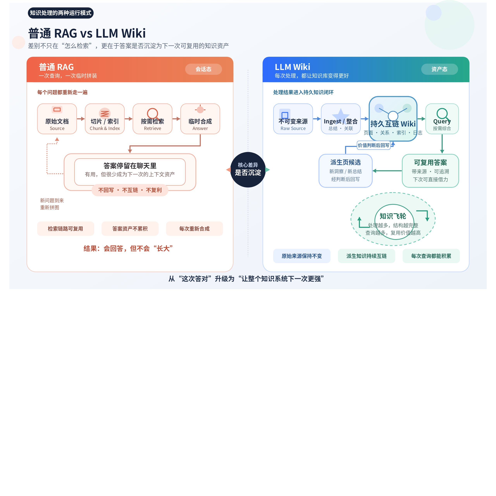
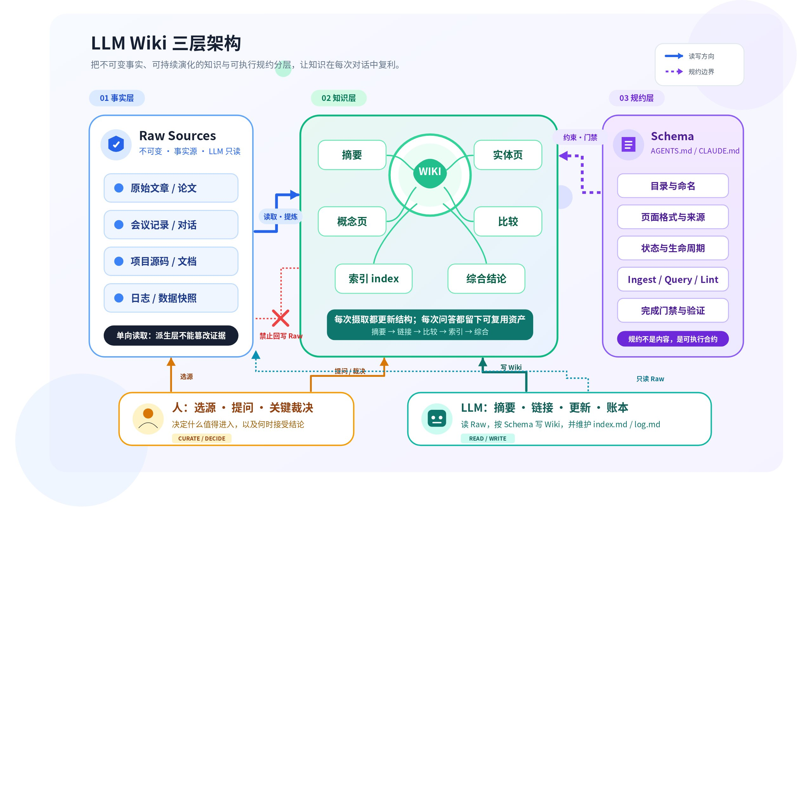
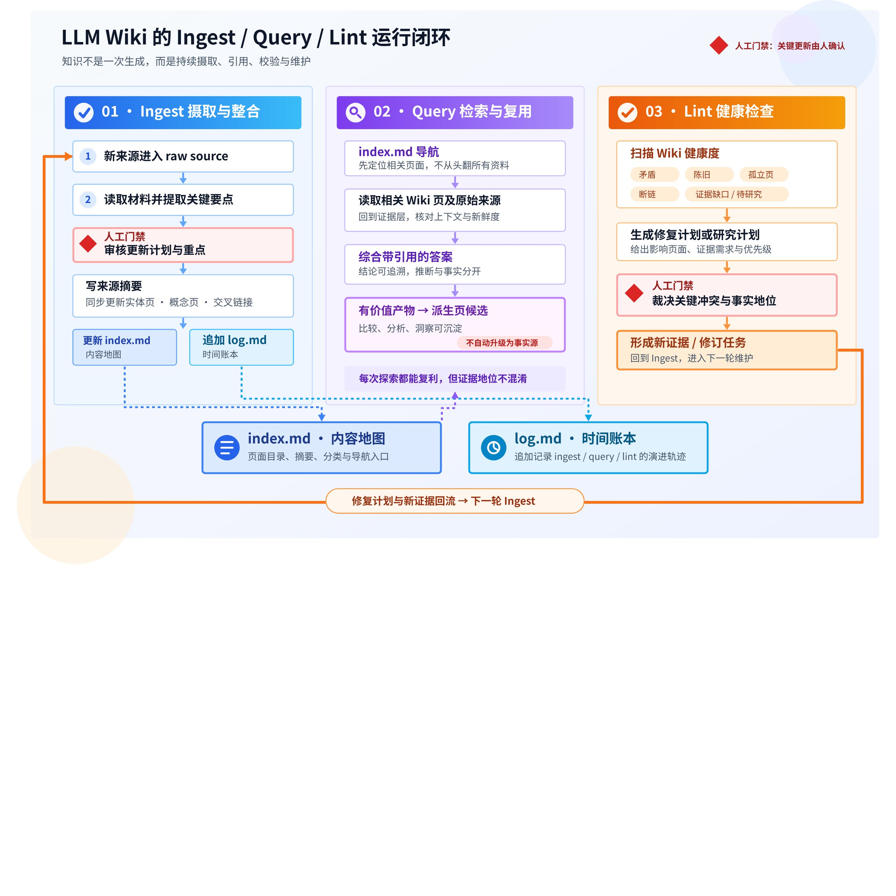

# LLM Wiki：把知识从一次性检索变成持续复利的系统

大多数文档问答系统擅长“现在回答一个问题”，却不擅长“把这次理解积累下来”。Karpathy 提出的 LLM Wiki，试图把知识管理从一次性检索改造成一个持续维护、不断增值的系统：原始材料保持不变，LLM 在其上维护结构化 Wiki，并通过明确的操作规范完成摄取、查询和健康检查。

> **一句话结论：** LLM Wiki 不是替代 RAG，而是在原始资料与用户问题之间增加一个“可持续维护的派生知识层”。知识被整理一次、持续修订，并在后续问题中复用。

## 1. 普通 RAG 的问题：每次提问都在重新拼图

典型 RAG 流程是“文档切片—检索相关片段—临时合成答案”。它很适合从大量资料中快速找出证据，但系统通常不会把本次跨文档推理沉淀成长期资产。下一次遇到类似问题，模型仍要重新检索、重新判断关系、重新处理冲突。

当问题只依赖一两个片段时，这种成本并不明显；当答案需要综合五份甚至更多资料时，系统会反复支付同一笔“理解税”。聊天记录可能保存了答案，却没有形成稳定的页面、关系、索引与变更历史。



LLM Wiki 的变化不在于检索算法，而在于知识生命周期：新材料进入后，不只是“等待未来被检索”，还会被主动吸收进已有结构。相关实体页得到更新，主题总结被修订，新旧说法的矛盾被标记，新的关系被补上。下次提问从已经整理过的知识出发，而不是从散落片段重新开始。

## 2. 核心思想：持久、可复利的知识产物

Karpathy 把 Wiki 称为一个 **persistent, compounding artifact**。所谓“持久”，是理解结果不只停留在某次对话中，而是落在可以阅读、编辑、链接和版本化的文件里；所谓“复利”，是每次新增来源、提出问题或完成校验，都可能让旧页面变得更完整。

> 知识不是在每次查询时重新推导，而是先被“编译”成结构化页面，再随着新证据持续维护。

这也重新划分了人和模型的工作。人负责选择值得信任的材料、提出好问题、判断重点与处理关键冲突；LLM 负责摘要、归档、交叉引用、索引更新和一致性检查。它不是替人决定“什么是真的”，而是接手人类最容易放弃的维护劳动。

## 3. 三层架构：事实源、派生知识与操作契约

LLM Wiki 的基本架构很克制，只需要三层，但三层的写权限和责任必须清楚。



| 层 | 作用 | 写入责任 | 关键约束 |
| --- | --- | --- | --- |
| **Raw Sources** | 文章、论文、图片、数据、会议记录等原始材料 | 由人或采集流程加入；LLM 只读 | 不可被模型改写，是最终事实来源 |
| **Wiki** | 摘要、实体页、概念页、比较页、综合结论与索引 | LLM 维护，人审阅 | 属于派生知识，必须保留来源与状态 |
| **Schema** | AGENTS.md、CLAUDE.md 或其他规则文件 | 人与 LLM 共同演化 | 定义目录、页面格式、引用、摄取、查询和校验规则 |

其中最容易被低估的是 Schema。没有 Schema，模型只是偶尔帮你写笔记；有了 Schema，模型才成为一个有边界、有固定工作流、能跨会话保持一致的 Wiki 维护者。它应当规定哪些路径只读、页面如何命名、证据如何引用、哪些状态可以写入、冲突由谁裁决，以及一次操作怎样算完成。

## 4. 三类操作：Ingest、Query 与 Lint

这套系统不是靠一个超长 Prompt 运转，而是靠三个可重复执行的操作闭环。它们分别负责“吸收新知识”“使用已有知识”和“修复知识系统”。



**Ingest（摄取）。**读取一个新来源，先提取要点并与人讨论，再生成来源摘要，更新相关实体页或概念页，补充交叉链接，更新 index.md，最后在 log.md 记录本次变化。一个来源可能同时影响十多个页面，因此摄取的本质不是“新增一页”，而是“把新证据合并进已有知识图景”。

**Query（查询）。**先读 index.md 定位候选页面，再按需读取相关页面和对应来源，综合答案并提供引用。若某次回答形成了可复用的比较、分析或新连接，可以作为派生页面候选回写 Wiki；但它不能因此自动升级为事实源。

**Lint（健康检查）。**周期性查找页面间矛盾、被新来源淘汰的陈旧说法、没有入链的孤立页、缺少独立页面的重要概念、断裂链接和证据缺口。Lint 的价值不只是“找错”，还在于生成下一轮研究问题和材料清单。

## 5. index.md 与 log.md：内容地图和时间账本

随着页面增长，LLM 和人都需要两种不同的导航方式：按主题找知识，以及按时间看发生过什么。Karpathy 用两个特殊文件承担这两个职责。

| 文件 | 回答的问题 | 推荐内容 | 更新时机 |
| --- | --- | --- | --- |
| **index.md** | Wiki 里现在有什么？相关页面在哪里？ | 分类、页面链接、一句话摘要、日期、来源数或状态 | 每次摄取或页面结构变化后 |
| **log.md** | 最近发生了什么？知识如何演化？ | 摄取、查询、Lint 的时间、对象、结果与影响页面 | 每次操作完成后追加 |

index.md 是内容导向的“地图”，log.md 是时间导向的“账本”。在大约百份来源、数百页面的中等规模内，一个维护良好的索引往往已能支持高质量导航；规模继续扩大后，再叠加全文搜索、BM25、向量检索或混合检索会更合适。

## 6. 为什么它可能有效：LLM 改变了维护成本

传统 Wiki 最难的不是第一次写，而是持续维护。新材料到来后，需要更新摘要、补链接、修订旧结论、记录变化并保持几十个页面一致。对人而言，这些工作会随着规模增长而迅速变得乏味；对 LLM 而言，它们恰好是可以批量执行的文本维护任务。

Karpathy 用一个很形象的比喻描述实践方式：Obsidian 是 IDE，LLM 是程序员，Wiki 是代码库。人一边与 Agent 对话，一边在 Obsidian 中查看页面、链接和图谱；LLM 根据讨论修改文件，Git 负责留下版本历史。这个比喻的重要含义是：知识库不再只是静态文档集合，而是一个需要规则、检查、版本和重构的“知识代码库”。

## 7. 不应忽略的边界：它是模式，不是现成产品

Karpathy 的原文刻意保持抽象：它是一份 idea file，用来向 Agent 说明高层模式，而不是一套可以直接安装的完整产品。目录结构、页面模板、工具和审批机制都需要按领域共同设计。

**可靠性边界。**Wiki 页面是模型生成的派生知识，不能与原始来源拥有同等证据地位。更稳妥的做法是让关键结论指回不可变来源或具体段落，并区分 verified、partial、draft 等状态，避免“Wiki 引用 Wiki”形成自我强化。

**冲突边界。**模型可以发现两段话可能矛盾并提出修订计划，但涉及事实裁决、实体创建、重要结论升级时，应保留人工审核。系统应记录“原来说了什么、为什么改变”，而不是静默覆盖。

**规模边界。**index.md 在中等规模有效，并不意味着它能无限扩展。页面进入数千甚至更大规模后，需要搜索、分层索引、按需加载或 RAG；此时 Wiki 与 RAG 更可能是互补关系，而非二选一。

**工程边界。**多人并发、权限隔离、敏感材料、失败恢复、幂等写入和审计都不是原文自动解决的问题。个人 Wiki 可以从 Git 和简单规则开始，团队场景则需要更明确的审批和系统约束。

## 8. 一个可落地的最小版本

最小实现不必先搭建向量数据库。可以从一个 Git 管理的 Markdown 目录开始：

```text
raw/                 # 不可变原始材料
wiki/
  index.md           # 内容地图
  log.md             # 操作账本
  sources/           # 来源摘要
  concepts/          # 概念页
  entities/          # 实体页
AGENTS.md             # Wiki 的操作契约
```

建议先定义五个规则：原始来源只读；每个派生结论必须能回到来源；页面有清晰状态；Ingest 必须更新 index 和 log；Query 默认只回答，只有明确值得长期复用时才提出回写。随后用少量真实材料跑通单篇摄取、一次跨页查询和一次 Lint，再根据失败案例迭代 Schema。

1. 选择一个边界明确、你会持续积累的主题。
2. 放入 5—10 份可信来源，不追求一开始就“全量导入”。
3. 逐篇 Ingest，并人工审阅模型提出的更新计划。
4. 用真实问题测试跨页综合、引用与不确定性表达。
5. 运行 Lint，把发现的问题写回 Schema，形成可重复规则。

## 9. 结语：真正的变化是让知识开始有生命周期

LLM Wiki 最有价值的地方，并不是“让 AI 多写一些 Markdown”，而是把知识从一次性回答变成有来源、有结构、有状态、有历史、能持续修订的长期资产。RAG 负责在需要时找到材料，Wiki 负责把已经完成的理解保留下来；Schema 则把模型的自由生成约束成可验证的维护流程。

当每次阅读和提问都能留下可复用成果，知识库才真正从存档工具变成复利系统。

## 参考资料

- [Andrej Karpathy：LLM Wiki（Gist）](https://gist.github.com/karpathy/442a6bf555914893e9891c11519de94f)
- [本文整理所依据的固定版本 Raw 文本](https://gist.githubusercontent.com/karpathy/442a6bf555914893e9891c11519de94f/raw/ac46de1ad27f92b28ac95459c782c07f6b8c964a/llm-wiki.md)
