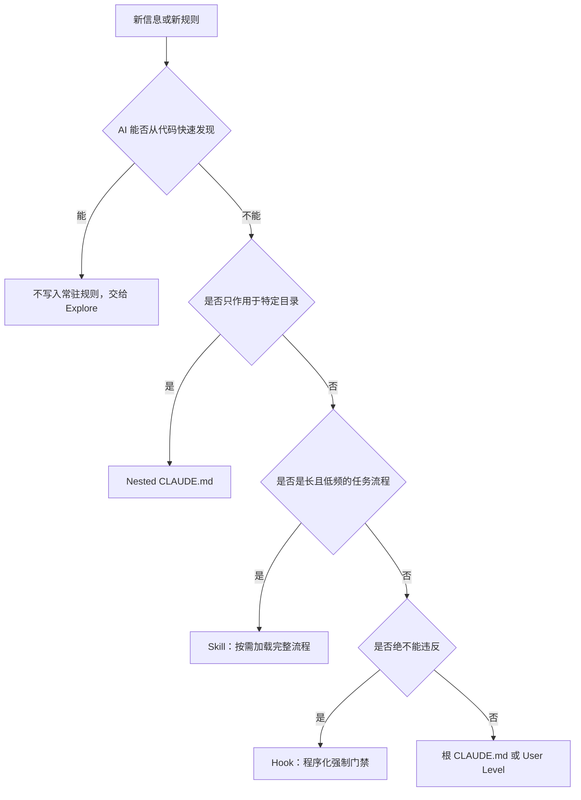

# CLAUDE.md 工程化指南：用最小规则预算构建可持续的 AI 编程上下文

CLAUDE.md 不是普通的项目说明书，而是一份会在 Claude Code 会话中持续影响模型行为的常驻指令。Codex 中承担相近职责的是 AGENTS.md。真正高质量的指令文件，不追求把项目介绍得面面俱到，而是用尽可能少的规则，保留模型无法自行发现、又会反复影响结果的隐性知识。

> 💡 **核心判断：**CLAUDE.md 的价值不取决于长度，而取决于信噪比。可从代码直接发现的事实交给探索机制；目录专属规则下沉到 Nested Level；低频长流程放进 Skill；绝不能违反的约束交给 Hook。根文件只保留稳定、广泛适用且无法靠代码推断的规则。

## 1. CLAUDE.md 的本质：常驻上下文，而不是百科全书

当 Claude Code 在项目中启动时，会读取适用范围内的 CLAUDE.md，并把其中内容加入当前 Context Window。它解决的是“每次开始工作前，模型必须先知道什么”：项目约束、编码习惯、验证标准、隐性业务规则，以及遇到未知问题时应去哪里寻找答案。

这带来两个直接收益。第一，不必在每个新会话里重复解释项目架构和协作习惯；第二，团队可以把共同规则与代码一起版本化，让不同成员获得更一致的 Agent 行为。但同样因为它会反复进入上下文，任何冗余、过期或互相冲突的内容都会持续消耗注意力。

可以把这里的成本拆成两层：**Context Window** 决定一次能容纳多少信息；**Instruction Budget** 则描述模型在这些信息中能同时识别、判断适用性并正确执行多少条要求。即使一段文字看起来只是背景说明，只要被写进 CLAUDE.md，模型就必须判断它与当前任务是否有关、是否与其他规则冲突，以及应该赋予多高优先级。

## 2. 分层加载：把规则放到最接近适用范围的位置

CLAUDE.md 可以出现在多个层级。规则不是简单地“选一份生效”，而是按工作位置组合；离正在处理的文件越近，适用范围通常越精确。

| 层级 | 典型位置 | 适合内容 | 协作属性 |
|-|-|-|-|
| User Level | `~/.claude/CLAUDE.md` | 跨项目的个人语言、输出结构、通用工作偏好 | 个人使用 |
| Project Level | `./CLAUDE.md` | 团队共享的项目规则、关键架构模式与常用验证命令 | 通常进入版本控制 |
| Nested Level | 子目录中的 `CLAUDE.md` | 只适用于前端、后端或特定模块的规则 | 通常进入版本控制 |
| 本地私有偏好 | `@~/.claude/...` 导入 | 不希望与团队共享、但只对当前项目有用的个人说明 | 保留在本机 |

例如，一个仓库同时包含 React 前端与 Python 后端时，根 CLAUDE.md 只保留全局规则；前端目录记录 UI 规范和视觉测试要求；后端目录记录接口、数据与服务端验证规则。Claude 读取对应子树文件时，再加载最接近该目录的指令，避免两套规则互相污染。

**当前性说明：**来源将 `CLAUDE.local.md` 作为本地私有层介绍；Anthropic 当前官方文档已把这一方式标为弃用，推荐通过 CLAUDE.md 的 `@path/to/import` 语法导入用户主目录中的私有文件。官方文档同时说明，导入可以递归，最大深度为 5；可以用 `/memory` 查看实际加载的文件。

## 3. 用 /init 建立第一版，但不要直接照单全收

在项目目录中执行 `/init`，Claude Code 会扫描代码库并生成一份起始版 CLAUDE.md。它通常包含项目用途、启动与测试命令、技术框架、目录结构和观察到的开发规范。对初学者而言，这是快速建立骨架的好方法；但它只是草稿，不是可以直接长期使用的最终版本。

问题在于，自动生成内容往往过于完整。Claude 在执行任务时本来就能通过 Explore 机制查看目录、读取 `package.json`、搜索代码和理解明显结构。如果把这些可发现事实再次写进常驻指令，模型每次开工都要重读自己原本就能找到的信息；项目结构变化后，旧说明还可能反过来误导模型。

因此，`/init` 的正确用法是“先生成，再审计”。审计目标不是润色文字，而是主动删除不值得消耗 Instruction Budget 的内容。

### 3.1 三问减法：判断一条内容是否应该留下

1. **AI 能否自己发现？**如果 Explore 很快就能从目录、配置或代码中找到，就不要写进常驻规则。应优先保留模型翻遍代码也猜不到的隐性知识，或藏得很深但后果严重的信息。
2. **它是否适用于大多数任务？**只与某个目录或模块有关的规则，应下沉到对应 Nested CLAUDE.md，等模型真正处理该区域时再加载。
3. **几个月后仍会成立吗？**暂时使用旧版 API、短期迁移策略等易失效要求，不应无期限常驻；如果必须记录，应明确失效条件并安排复核。

## 4. 五问加法：把人脑中的隐性知识提炼出来

做完减法后，CLAUDE.md 可能只剩很少内容。这不是缺陷，而是为真正有价值的规则腾出了预算。可以用以下五个问题提炼模型无法自行推断的经验。

1. **项目中有什么绝对不能搞错？**例如电商页面对客价格必须含税。模型很难仅从局部代码推断这一业务约束，但违反它会直接影响用户。
2. **有没有固定处理方式？**例如商品价格必须先改试算表，再同步到网站；直接修改网页数字会在下一次同步时被覆盖。
3. **改完一个地方，还有哪些连动关系？**例如会员价格变化后，首页、结账页、常见问题和通知邮件必须同步更新。
4. **做到什么程度才算完成？**例如页面修改后要检查桌面端和移动端；购买流程修改后必须实际跑一笔测试订单。
5. **遇到不懂的问题应该去哪里找答案？**例如文案查品牌语气指南，退款问题查退款规则。CLAUDE.md 只负责提供入口，不需要复制整份资料。

这五类内容分别对应不可违反的业务边界、标准入口、跨模块依赖、验收标准和知识路由。它们通常不会自然显现在代码局部，却会决定任务是否真正正确。

## 5. 不是什么都放进 CLAUDE.md：规则归位决策

从根文件中删除的内容不等于没有价值，而是应该进入更合适的承载层。下面这张决策图给出一个实用归位顺序。



| 信息类型 | 推荐承载位置 | 原因 |
|-|-|-|
| 代码库中的客观现状 | Explore / 搜索 | 按需读取，避免重复与过期 |
| 模块专属规则 | Nested CLAUDE.md | 只在相关目录中生效 |
| 十几步的发布或检查流程 | Skill | 低频、体量大，适合渐进式披露 |
| API key 绝不能提交等硬约束 | Hook 或 CI 门禁 | 仅靠模型记忆仍可能漏掉，必须确定性阻断 |
| 稳定且广泛适用的隐性知识 | 根 CLAUDE.md | 每个相关任务都需要，且无法从代码推断 |

尤其要区分“提醒”与“强制”。把“API key 绝不能提交到 Git”写在 CLAUDE.md 里，只是一条模型需要记住的指示；在 `git commit` 前运行密钥扫描并直接阻断，才是可证明执行的 Hook。后果越严重，越不能只依赖自然语言提醒。

## 6. 长期维护：像花园一样持续新增与修剪

CLAUDE.md 最常见的退化路径是只增不减：每当模型犯错，就补一条规则。每条新增在当时都合理，但长期累积后，文件会变得臃肿、冲突且难以执行。更健康的维护方式只有两个动作：新增真正反复出现的规则，以及修剪已经失效的限制。

### 6.1 从历史协作中发现值得新增的规则

来源演示使用 Claude Code 的 `/insights` 分析历史会话，识别重复发生的提醒、工作方式和失败模式，并据此建议新增 CLAUDE.md 规则、Skill 或 Hook。如果当前版本提供该命令，可以把它作为经验采集工具；具体可用性应以本机 Claude Code 版本为准。

关键不是把报告中的建议全部加入，而是只处理确实重复、后果明确的问题：反复被提醒的稳定偏好，可以进入规则；重复出现的长流程，更适合 Skill；绝不能漏掉的动作，则应上升为 Hook。

### 6.2 两类必须勇敢删除的规则

**第一类，是模型变强后不再需要的规则。**来源援引 Claude Code 团队的一次系统提示词优化：针对新一代模型删除了原有规则的超过 80%，能力并未因此退步。这里的比例属于来源口径，未在本文中独立复核；它要表达的工程原则是，曾经帮助旧模型少犯错的限制，到了新模型上可能变成束缚。

**第二类，是已经与真实 Codebase 或工作流不符的规则。**如果代码结构、依赖、发布方式或团队流程已经变化，仍然保留旧规则会让 Agent 优先相信错误的常驻上下文。只要规则与当前事实冲突，就应删除、修正或改为指向权威资料。

一个可执行的健检流程是：先确认当前使用的模型和官方 Prompting Guide；再逐条检查现有规则是否符合当前模型建议；最后回到真实 Codebase 验证规则仍然成立。不要把“过去踩过坑”当成永久保留的理由。

## 7. 三个健检案例：从重复维护转向 Single Source of Truth

来源中的一次 Opus 5 健检给出了三个典型问题。

1. **规则与其他文档冲突。**处理方式不是继续补充解释，而是删除重复段落，只保留一行指向真正权威的文件。
2. **网页测试流程整段常驻。**这类只在特定任务触发、步骤很长的内容，应迁移到 Skill，需要测试时再加载。
3. **CLAUDE.md 与 AGENTS.md 双份维护。**可以在 CLAUDE.md 中使用 `@AGENTS.md` 引用，把 AGENTS.md 作为 Single Source of Truth，减少规则漂移。

Anthropic 官方文档确认 CLAUDE.md 支持 `@path/to/import`，因此“引用而不是复制”不仅是一种写作技巧，也是工具原生支持的治理方式。它能把常驻文件压缩为路由层，把详细知识留在真正的权威来源中。

## 8. 一份可直接使用的最小模板

下面的模板刻意保持精简。它不是让每个项目照抄，而是展示“只写隐性知识和可执行边界”的结构。

```markdown
# 不可违反的项目规则
- 对客价格必须含税；任何新增展示都沿用同一口径。

# 固定入口与连动关系
- 商品价格只能从权威数据源修改，禁止直接改生成页面。
- 修改会员价格时，同步检查首页、结账页、FAQ 与通知邮件。

# 完成标准
- UI 变更必须验证桌面端与移动端。
- 购买流程变更必须完成一笔测试订单。

# 知识路由
- 文案规范见 @docs/brand-voice.md
- 通用 Agent 规则见 @AGENTS.md
```

真正使用时，再把只属于某个模块的要求下沉，把长流程拆到 Skill，把硬性安全检查交给 Hook。根文件越短，越容易审计、执行和维护。

## 参考资料

- [Anthropic 官方文档：管理 Claude 的内存](https://docs.anthropic.com/zh-CN/docs/claude-code/memory)。
