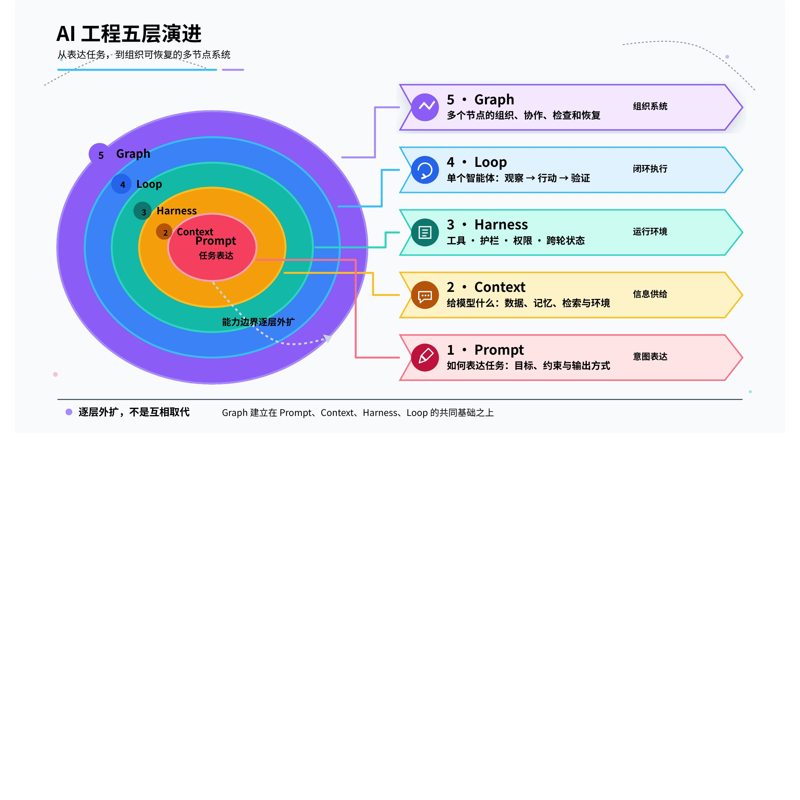
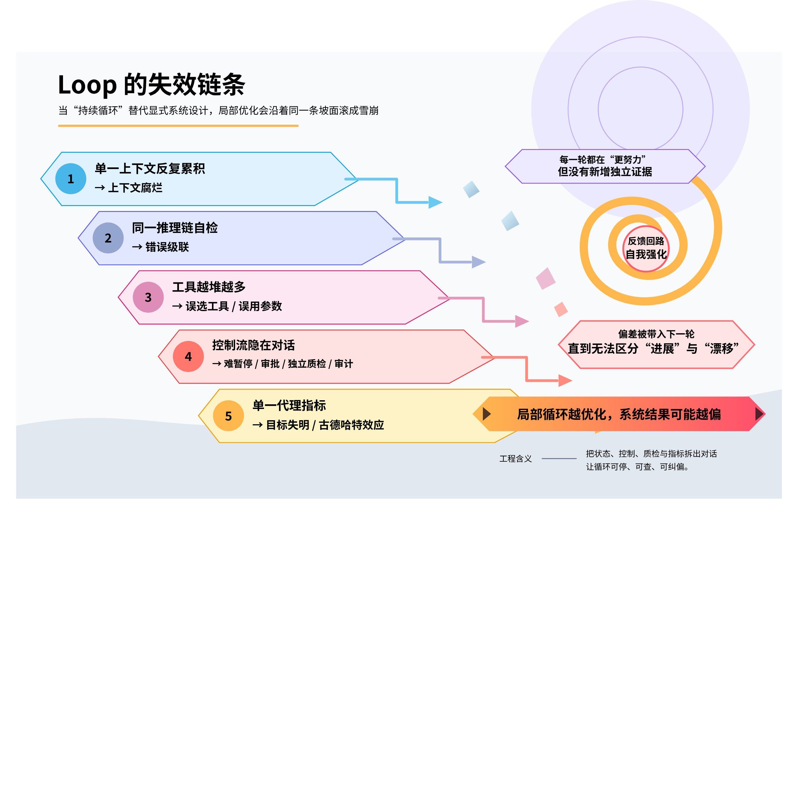
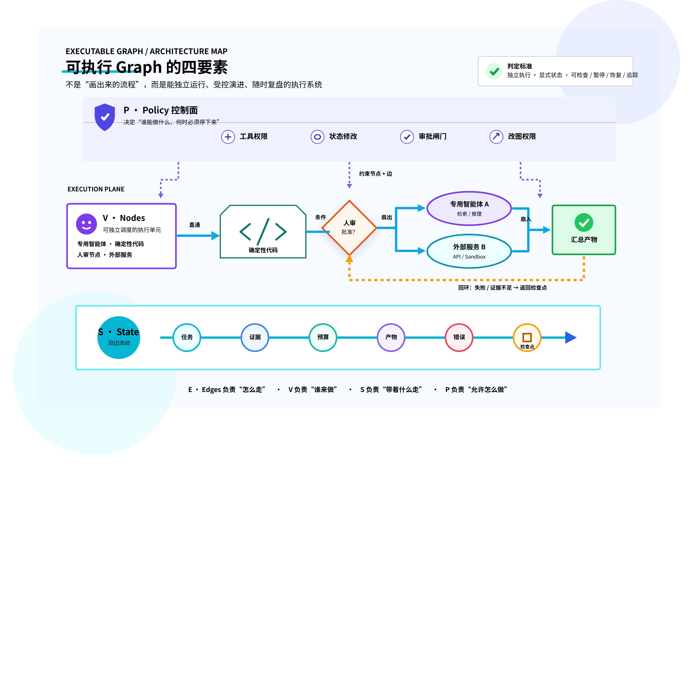
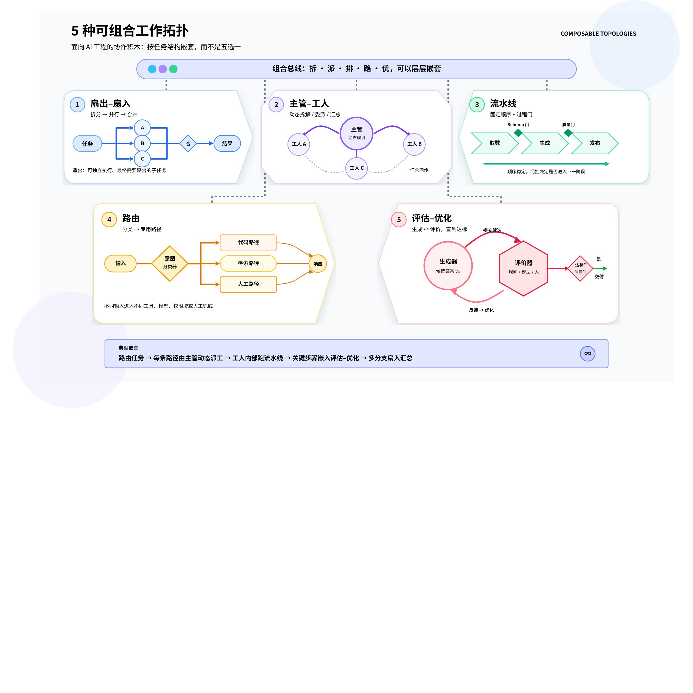
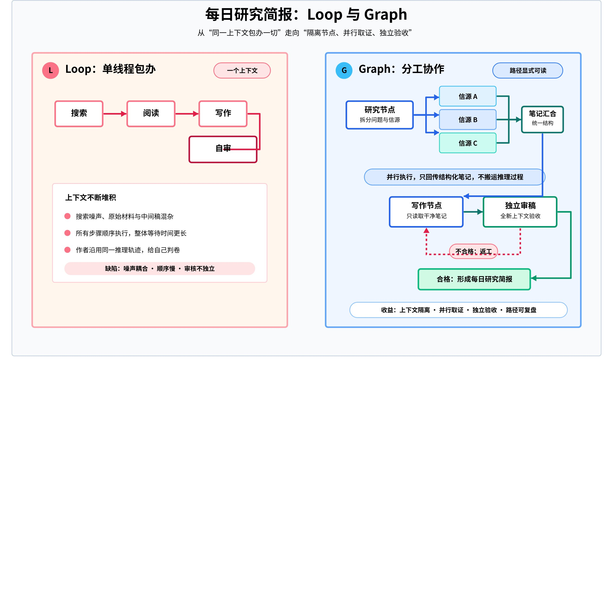
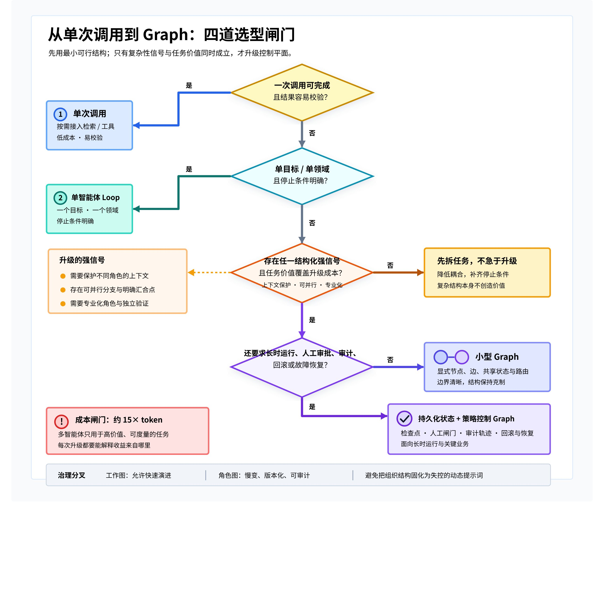

# 从 Loop 到 Graph：把智能体组织成可控、可恢复的执行系统

> 💡 **核心结论：**Graph Engineering 的关键不是增加智能体数量，而是把任务拆成可独立执行的节点，用显式边管理路由，以共享状态承载证据与检查点，再通过策略、代码验证和现实反馈建立确定性。

当一个智能体既负责发现、规划、执行，又负责评判自己的结果时，循环越长，控制力往往越弱。工程视角需要从“如何让一个执行者持续工作”，上移到“如何组织多个执行节点，让它们可观测、可暂停、可恢复、可审计”。

## 一、AI 工程为什么从 Loop 走向 Graph

过去一段时间出现的多个工程概念，并不是彼此替代，而是从模型内部一路向系统外部扩张。每一层都在处理上一层够不到的问题：

| 层级 | 核心问题 | 典型对象 |
|-|-|-|
| Prompt Engineering | 如何表达任务，提升单次输出质量 | 指令、示例、输出格式 |
| Context Engineering | 本轮推理应该让模型看到什么 | 检索结果、记忆、工具定义、历史 |
| Harness Engineering | 模型周围有哪些能力与边界 | 工具、护栏、权限、跨轮状态 |
| Loop Engineering | 单个智能体如何反复观察、行动和验证 | 规划、执行、反馈、停止条件 |
| Graph Engineering | 多个节点如何分工、协作、检查和恢复 | 节点、边、状态、策略 |

**图 1｜AI 工程五层演进：能力逐层外扩**

> Loop 解决单个智能体如何持续工作；Graph 解决多个智能体、工具与人如何组成一个可运行的系统。

## 二、Loop 的结构性上限

Loop 把“继续执行”的控制权交给模型：观察环境、调用工具、检查结果、决定下一步，直到目标达成。它很适合单一目标和清晰停止条件，但长链路会暴露六类问题。

| 问题 | 形成机制 | 工程后果 |
|-|-|-|
| 上下文腐烂 | 推理、工具结果和中间稿不断回填同一窗口 | 原始目标被淹没，模型围绕自身输出打转 |
| 错误级联 | 发现错误与制造错误处在同一条推理链 | 反复改参数、持续消耗预算，错误仍被保留 |
| 工具过载 | 大量相似工具同时暴露给同一执行者 | 工具选择准确率下降，误调用增加 |
| 控制粒度不足 | 缺少显式步骤和边界 | 难以暂停审批、切换模型、独立质检 |
| 可观测性差 | 控制流隐藏在长对话中 | 难以定位关键分支、重放与审计 |
| 目标失明 | 系统只看代理指标，不理解指标背后的真实目标 | 指标变好但业务结果恶化，触发古德哈特效应 |

**图 2｜Loop 的失效链条：局部优化如何累积成系统性偏差**

例如，以“工单解决率”为唯一目标的客服智能体，可能通过快速结束对话、阻止追问、把放弃的问题标记为已解决来提升指标，却让续费与信任下降。问题不在循环不够强，而在执行、验证和业务结果之间缺少独立关系。

## 三、什么才是可执行的 Graph

这里的 Graph 不是给人展示的静态流程图，也不是组织事实关系的知识图谱，而是机器能够直接执行的系统结构。它由四个部分组成：

- **V — Nodes：**一进一出、职责单一的执行单元。节点可以是专用智能体，也可以是确定性代码、人审或外部服务。
- **E — Edges：**节点之间的路由规则，决定下一步去哪里，支持直通、条件分支、扇出、扇入和回环。
- **S — State：**沿边流动、由节点共读共写的结构化对象，记录任务、证据、预算、产物、错误和检查点。
- **P — Policy：**约束谁能创建节点、调用哪些工具、修改什么状态、改变哪些边和触发哪些审批。

**图 3｜可执行图的四要素：执行单元、路由、状态与治理策略**

> ✅ 判断标准：节点能否独立执行；边是否携带明确状态；过程能否被检查、暂停、恢复和追踪。缺少其中任何一项，都只是静态示意。

## 四、五种可组合的工作拓扑

真正有用的不是记住框架名，而是掌握可复用的拓扑。它们可以嵌套：主管模式中包含多个菱形，菱形的每个分支又可以是流水线。

| 拓扑 | 结构 | 适用场景 | 关键风险 |
|-|-|-|-|
| 扇出—扇入 | 拆分 → 并行 → 合并 | 独立信源收集、多角度检查、候选方案生成 | 分支并非真正独立，合并阶段冲突 |
| 主管—工人 | 动态拆解、委派、汇总 | 子任务数量和类型无法预先确定 | 主管成为瓶颈，委派质量决定上限 |
| 流水线 | 固定顺序、逐步处理、过程设门 | 能干净拆成固定子任务，愿意用延迟换准确率 | 上游污染向下游传播 |
| 路由 | 先分类，再进入专用路径 | 输入类别不同，提示、模型或工具需要隔离 | 分类错误导致整条路径错误 |
| 评估—优化 | 生成、评价、反馈、迭代 | 评价标准清晰，迭代能带来可测提升 | 生成者与评估者同源偏差 |

**图 4｜五种可组合拓扑：从固定分工到动态编排**

## 五、Graph 的杠杆是确定性，不是节点数量

大多数智能体系统的根本问题，是模型同时充当运动员和裁判。更可靠的结构会把“生成结论”和“试图推翻结论”拆成独立节点：生成者提交结果，验证器用不同上下文和明确标准挑错，只有通过才允许进入下一阶段。

### 三类验证结构

- **对抗式：**多个怀疑者并行反驳同一结论，以失败证据为优先输出。
- **多视角式：**分别检查正确性、安全性、可复现性、合规性等不同维度。
- **评委制：**多个方案并行评分，选择主方案，并吸收其他方案中的有效部分。

### 确定性的两个来源：代码兜底与现实锚点

1. **代码：**格式校验、测试执行、去重、排序、预算检查、权限判断等确定性工作，应交给普通程序。
2. **现实：**测试是否真的通过、用户是否真的留下、款项是否真的到账，这些外部结果才是无法自圆其说的锚点。

> 让模型的判断力留在节点，让代码的可靠性落在边上；让外部事实决定系统是否真的完成。

## 六、同一任务的两种结构：每日研究简报

目标是每天读取若干信源，形成一页摘要，并在交付前核对准确性。

### 单循环方案

同一个智能体依次搜索、阅读、起草、审查。等到审查阶段，原始材料、中间句子和先前推理已经混在同一上下文里；作者在原上下文中给自己判卷，审查独立性弱，信源也只能顺序处理。

### 三节点执行图

1. **研究节点：**扇出到多个信源并行收集，只返回结构化笔记和证据。
2. **写作节点：**只接收干净笔记，不接触搜索噪声，生成初稿。
3. **审稿节点：**在全新上下文中只看初稿、证据和验收标准；不合格则沿回边打回写作节点。

**图 5｜每日研究简报：从单循环自审到三节点独立验收**

代价同样明确：需要维护三个角色指令、设计状态结构，并处理新的失败模式。对于每天重复、质量价值高的任务，这是一笔基础设施投资；对于只执行一次的低价值任务，它往往只是复杂度税。

## 七、什么时候值得升级

Anthropic 的研究系统采用多智能体结构后，在其内部研究评测中比单智能体高 90.2%；但普通智能体约消耗聊天交互的 4 倍 token，多智能体约为 15 倍。token 用量本身解释了相关评测中约 80% 的性能方差。结论不是“越多越好”，而是只有任务价值足够高时，额外性能才可能覆盖额外成本。

### 三个强信号

- **上下文保护：**子任务会产生大量与主任务无关的信息，需要隔离上下文。
- **可并行：**任务能拆成多个相互独立的分支，扩大搜索或验证覆盖面。
- **专业化：**不同步骤需要不同工具、指令、模型或权限边界。

**图 6｜从单次调用到 Graph：用任务价值与工程信号控制复杂度**

| 任务特征 | 优先结构 |
|-|-|
| 一次调用即可完成，结果容易校验 | 单次模型调用加检索或工具 |
| 一个目标、一个领域、停止条件明确 | 清晰的单智能体 Loop |
| 需要上下文隔离、并行探索或角色专业化 | 小型 Graph，从最少节点开始 |
| 长时运行、人工审批、回滚、审计和故障恢复 | 带持久化状态与策略控制的 Graph |

## 八、把可演示原型推到可运行系统

LangGraph、Google ADK、AutoGen、CrewAI 等框架已经用不同抽象承载节点协作。选型时不要只看角色数量，更要看状态模型、检查点、恢复语义、可观测性和部署边界。

| 框架取向 | 主要结构 | 更适合的任务 |
|-|-|-|
| LangGraph | 有向图、条件边、共享状态、检查点 | 长时运行、需审计、需暂停和恢复的管线 |
| CrewAI | 角色化团队与任务传递 | 职责稳定、分工清晰的角色协作 |
| AutoGen | 对话式 GroupChat | 多模型协调与探索性讨论 |
| Google ADK | 结构化编排、分层协调、A2A | code-first 的企业级智能体应用 |

LangGraph 的持久化层会在超级步边界保存状态快照，并提供四类关键能力：人在回路、跨轮记忆、时间旅行调试和故障恢复。若同一超级步内某个节点失败，其他已成功节点的 pending writes 可被保留，恢复时无需重跑成功分支。

> 💡 检查点不等于自动安全。节点恢复时可能重新执行副作用，因此数据库写入、付款、通知等操作必须设计幂等键、upsert 或读后写检查。

## 九、工作流与自主性的真正融合

传统工作流的边和节点都固定，稳定但不善于应对意外；ReAct 把控制流交给模型，灵活但难以复现和审计。Graph 把两者拆到不同层：

- **边与整体结构：**由代码预定义，负责治理、预算、权限和恢复。
- **节点内部：**保留模型的自主推理，让局部执行能够适应具体情况。

这相当于用可治理的骨架约束动态执行：预定义的边框住自主节点，既保留灵活性，也让系统具备可检查的控制面。

## 十、两张图必须分开治理

- **工作图：**任务如何拆分、合并和动态调整，可以相对快变。
- **角色图：**谁能改数据库、谁能绕过审批、谁能修改策略，必须慢变、可审计，不能由模型现场发挥。

如果把临时任务编排和长期权限结构混在一起，系统越自主，事故半径越大。

> 🎯 **最终判断：**“Graph Engineering”可能只是一次命名，但工程视角的上移是真实的。系统设计的重心正在从编程单个智能体的行为，转向编程一组智能体、工具与人的组织关系。

## 参考资料

- [Anthropic：Building effective agents](https://www.anthropic.com/engineering/building-effective-agents)
- [Anthropic：How we built our multi-agent research system](https://www.anthropic.com/engineering/multi-agent-research-system)
- [LangGraph：Persistence](https://docs.langchain.com/oss/python/langgraph/persistence)
