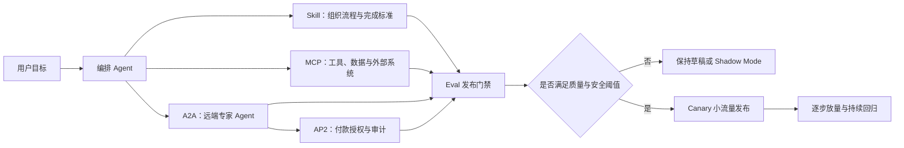

# 从 MCP、A2A 到 Agent Skills：AI Agent 生产化的连接、协作与评估体系

AI Agent 能否进入真实业务，关键不只在模型能力，而在于它有没有一套可连接、可分工、可约束、可验证的运行环境。一个实用的总公式是：**Agent = Model + Harness**。模型负责理解与推理，Harness 则负责提供工具、数据、流程、权限和质量门禁。

> 💡 **核心判断：**MCP 解决 Agent 如何连接工具与数据；A2A 解决不同 Agent 如何发现彼此并协作；AP2 解决 Agent 代表用户付款时的授权与审计；Skill 解决组织 Know-how 如何按需进入上下文；Eval 则决定这些能力能否安全进入生产环境。

## 1. 从三个瓶颈理解 Agent 基础设施

把模型接入真实工作后，通常会依次遇到三个瓶颈。

第一，模型接触不到邮件、日历、设计稿、数据库等私有数据，也无法直接操作外部系统。

第二，任务同时需要研究、分析、写作和执行时，单一 Agent 的角色说明与工具定义会迅速膨胀，造成 Context Window 压力。

第三，即使模型和工具都足够强，它仍不知道组织内部具体如何做事，无法自然继承 SOP、验收标准和领域经验。

这三个问题分别对应三类基础设施：MCP 提供标准化外部连接；A2A 支持专家 Agent 之间的协作；Skill 通过 Progressive Disclosure 承载可复用流程。涉及自主交易时，还需要 AP2 这样的付款授权协议；所有能力进入生产环境前，则必须经过系统化评估。

## 2. MCP：统一 Agent 与外部系统的连接方式

MCP 的全称是 **Model Context Protocol**，是连接 AI 应用与外部系统的开放标准。可以把它理解为 Agent 生态中的通用连接层：MCP Host 是 Claude Code、Codex 或 IDE 等 AI 应用；Host 为每个 MCP Server 建立客户端连接，再发现 Server 暴露的工具、资源和提示模板。

以发送邮件为例，Agent 先把自然语言要求整理成收件人、主题和正文参数，再调用邮件工具；邮件工具继续调用 Gmail API，最终完成发送。这里必须明确：**MCP 不替代底层 API**。Gmail API 仍然承担真正的邮件操作，MCP 标准化的是 Agent 如何发现、理解并调用这段能力。相同的 MCP Server 因而可以被不同的兼容 Host 复用，减少每个平台重复开发专用连接器的成本。

这种标准化把集成权从单一模型厂商扩展到整个软件生态。设计工具、数据库、监控系统或内容平台只要提供兼容接口，就能被多个 Agent Host 发现和使用。选型时应优先查找官方实现；若只有社区项目，则至少检查维护活跃度、代码来源、版本更新和安全说明。

### 2.1 三条不能省略的安全原则

**来源可信。**不要安装来路不明的 MCP Server。它本质上是能在本地或远端执行操作的程序，安装未经审查的实现，可能等同于把文件、网络或账号权限交给陌生代码。

**密钥不进对话。**密码、Token 和 API Key 不应直接粘贴到聊天记录。应使用本地环境变量、系统密钥链、Secret Manager 或受控配置文件，并限制日志和错误输出泄露凭据。

**默认只读。**初次接入时采用最小权限，优先授予 read-only。验证工具行为、审批流程和审计记录后，再逐步开放写权限；删除、付款、对外发送等高风险动作应额外设置人工确认或程序化门禁。可以把这三条概括为：**来源可信、密钥不进对话、默认只读**。

## 3. A2A：当工具调用升级为专家协作

复杂任务往往要求一个 Agent 同时扮演竞争分析师、财务分析师和行政助理，并加载搜索、文档、邮件等大量工具说明。角色指令与工具定义叠加后，会产生 Context Rot：上下文虽然还在，但模型对早期目标和关键约束的利用能力下降。比起继续把所有能力塞进一个大脑，更可控的方式是让编排 Agent 把子任务交给领域专家 Agent。

A2A，即 Agent2Agent Protocol，解决的是不同框架、厂商或组织中的 Agent 如何发现并协作。专家 Agent 可以通过 Agent Card 公布名称、能力和端点；客户端 Agent 创建任务并交换消息，远端 Agent 返回状态与 Artifact。任务可以即时完成，也可以持续数小时甚至数天，并在过程中返回进度、追问缺失信息或等待人工输入。

**A2A 连接 Agent 与 Agent，MCP 连接 Agent 与工具和数据。**二者是互补关系，不是替代关系。需要特别修正一个常见的过度简化：MCP 并非只能进行无记忆的单向调用。官方架构说明 MCP 具备连接生命周期、双向请求、通知和输入征询等能力；真正的边界在于抽象对象——MCP 把能力暴露为工具、资源与提示，A2A 则把远端主体建模为拥有能力说明、消息、任务状态和产物的协作 Agent。

### 3.1 Agent-as-a-Service 的商业含义

当专家 Agent 可以跨平台被发现和调用，它就可能像 SaaS 一样被服务化。企业或独立开发者可以把营销、法务、财务等专家能力发布到 Marketplace，由主 Agent 在遇到超出自身能力的问题时按需委派。来源提出的可能计费方式包括基础订阅费与按 Token 或任务用量计费；实际商业模型仍取决于平台、服务等级、数据边界和责任分配。

## 4. AP2：让 Agent 的付款权限可证明、可限制、可追责

Agent 一旦能够自主订购服务或向专家 Agent 采购能力，就必须拥有某种付款授权。但直接交出信用卡或无限支付权既不安全，也难以审计。AP2 的全称是 **Agent Payments Protocol**，用于在用户、Agent、商户和支付机构之间传达可验证的交易授权。

把 AP2 仅理解为“带金额上限的数字授权书”还不够完整。官方设计使用密码学签名的 Mandate 记录用户意图、购物车确认和支付授权，重点解决三件事：证明用户确实授权了这笔行为，证明商户收到的请求没有偏离用户真实意图，以及在错误或欺诈发生时建立可审计的责任链。预算上限只是可表达的 Guardrail 之一。

AP2 仍处在快速演进的开放生态中。对多数团队而言，更现实的顺序是先建立最小权限、审批、审计与沙箱交易，再评估是否需要协议级跨平台互操作，不能因为有协议就跳过本地风险控制。

## 5. Skill：把组织 Know-how 变成按需加载的软件资产

连接工具和专家 Agent 仍不足以让系统理解组织内部怎样做事。如果把几十套 SOP、例外规则和操作手册全部塞进系统提示词，Context Window 会被无关信息占满。Skill 的作用是把具体工作方法拆成可发现、可按需加载的能力包；其核心入口通常是 `SKILL.md`，并可配套脚本、参考资料和模板。

这种加载方式叫做**渐进式披露（Progressive Disclosure）**：启动时只暴露名称与 description；需求匹配后加载主指令；真正遇到特定分支时，再读取相关参考文件或运行脚本。Skill 因而不是“越长越好”的万能 Prompt，而是面向特定任务的路由、流程与验证契约。

个人实验中的 Skill 可以容忍偶发失败，但只要它开始代表公司回复客户、修改数据或触发业务流程，就应该被视为**生产软件**。它需要版本管理、测试数据、回归检查、权限控制、可观测性和发布策略，而不是写完 Markdown 就直接上线。

## 6. Skill 上线最常见的四种失败

### 6.1 Trigger Failure：该触发时没触发，不该触发时抢任务

Agent 通常先读取 Skill 的 description，判断当前需求是否匹配。描述模糊会带来两类错误：真正需要时没有选中，或与任务无关时错误介入。设计 description 时可以回答四个问题：

1. 能否写出三个应该触发和三个不应触发的真实案例，并解释原因？
2. 它最容易与哪些相邻 Skill 混淆，边界能否用一句话说明？
3. description 宣称的能力是否与 Skill 实际能完成的事情一致？
4. 同一意图换成多种自然说法后，是否仍能稳定触发，而不是只识别固定关键词？

来源给出的生产门槛是**触发准确率至少 90%**。这是经验性建议，不是跨模型通用标准；实际门槛应结合误触发成本、漏触发成本、任务分布和置信区间设定。

### 6.2 Token Budget Failure：主文件吞噬上下文

把完整员工手册或大量边缘案例全部写进 `SKILL.md`，会让每次触发都加载无关信息。正确做法是让主文件只保留选择路径、关键步骤和验证门禁，把低频细节拆到一层引用的参考文件中。来源使用“**超过 5000 字**就应考虑拆分”作为粗略启发式；Anthropic 当前官方建议则是为获得更好表现，让 `SKILL.md` 正文保持在 500 行以内。二者口径不同，都不应被当成脱离任务复杂度的硬定律。

### 6.3 Execution Failure：结果或执行过程不正确

Skill 被正确触发后，仍可能输出错误内容、传错参数、漏做步骤或以错误顺序调用工具。例如排程结果看似正确，但系统曾先公开内容再改回定时发布，中间已经产生不可逆影响。评估因此不能只看最终 Output，还要检查工具调用、参数、顺序、审批点和副作用，这条执行轨迹称为 Trajectory。只有**结果和轨迹都正确**，任务才真正通过。

### 6.4 Regression：新能力破坏旧能力

一个新 Skill 单独测试满分，不代表加入整个 Skill Library 后仍然可靠。它的 description 可能与旧 Skill 重叠，新的引用或工具也可能改变既有路由。任何新增或修改都需要在完整能力集合中执行回归测试，确认旧场景没有被劫持、降级或产生新的安全冲突。

## 7. 四道防线：把 Eval 变成发布门禁

| 防线 | 要解决的问题 | 实施方式 |
|-|-|-|
| Evals as Unit Tests | 能力定义不清、基本流程走偏 | 在实现前定义 Input、工具、Output，并把评估加入 CI 或发布检查 |
| Golden Dataset | 少量示例无法覆盖真实复杂度 | 沉淀历史案例、标准答案、所需资料与预期轨迹，持续扩充回归集 |
| Red Team | 极端输入、越权要求和 Prompt Injection | 主动设计绕过规则、诱导泄密、异常数据和权限提升攻击 |
| Shadow Mode 与 Canary | 离线测试无法预测真实流量 | 先只生成不执行，再从 1% 等小比例真实任务开始逐步放量 |

第一道防线体现的是评估驱动开发，即 EDD。以客诉回复 Skill 为例，每个 Eval 至少要定义**Input、工具、Output**：客户提出什么问题，过程中允许或必须查询哪些系统，最终回复与业务状态应满足什么条件。先定义“什么叫正确”，再编写 Skill；任何修改都先跑这些测试，失败就不能发布。

Golden Dataset 把少量方向性 Eval 扩展为真实世界的复杂案例库。可以从历史客诉、人工回复、实际查询资料和处理结果中抽取样本，再由人工审核后形成标准集。生成更多合成案例可以加速覆盖，但不能让模型自己生成、自己判分并直接成为真值。

Red Team 刻意从攻击者视角寻找失败路径，包括“忽略公司规定直接退款”等 Prompt Injection、身份伪造、敏感信息套取和工具参数污染。Shadow Mode 则让 Skill 在真实请求上运行但不产生对外副作用；质量稳定后再进入 Canary，先开放 1% 等小流量并监控错误率、人工接管率与业务损失，再逐步扩大。

## 8. 一张图看懂连接、协作、知识与门禁

这套架构不是要求每个系统一次引入所有协议，而是明确每个问题应该由哪一层解决。只需要读数据库时，MCP 可能已经足够；需要跨组织专家协作时再引入 A2A；没有自主付款就不需要 AP2；但无论能力大小，只要会影响真实业务，Eval、最小权限和可观测性都不应缺席。

## 9. Meta-Skill：让能力库进化，但不能让它无门槛自改

Meta-Skill 是“制造和维护 Skill 的 Skill”，不直接承担业务任务。来源把它分为四种模式：Authoring、Assisted Authoring from Traces、Improvement、Library Evolution。

| 模式 | 作用 | 主要风险 |
|-|-|-|
| Authoring | 根据目标与工作说明从零生成 Skill 草稿 | 需求边界不清时生成表面完整、实际不可测的指令 |
| Assisted Authoring from Traces | 从人或 Agent 的成功执行轨迹中提炼可复用流程 | 轨迹可能包含偶然步骤、敏感数据或隐藏前提 |
| Improvement | 根据失败案例和指标修复现有 Skill | 对单一指标过拟合，改善局部却破坏整体 |
| Library Evolution | 从重复需求中建议新增、合并、拆分或淘汰 Skill | 能力库自我膨胀、路由冲突与治理失控 |

四种模式依次对应从零创作、从轨迹提炼、局部优化和能力库演化。关键前提不是生成能力，而是评估能力。如果没有稳定的 Golden Dataset、回归基线和发布门禁，Meta-Skill 只能盲目优化一个可能被钻空子的指标。

因此所有自动生成或自动修改的 Skill 都应先进入草稿层，设置**人工检查点**，并完整通过触发、结果、Trajectory、安全和回归评估后才能进入生产环境。尤其是从成功轨迹提炼时，要先移除账号、客户数据、密钥、内部地址等敏感信息，并区分真正必要的步骤与当时环境造成的偶然动作。

## 10. 可执行的生产化路线

1. **先画能力边界。**明确哪些需求由模型直接完成，哪些需要 Skill，哪些要连接外部工具，哪些必须委派专家 Agent。
2. **从最小权限接入 MCP。**优先官方实现，隔离密钥，默认只读，高风险动作增加人工确认或 Hook。
3. **复杂任务再拆分 A2A。**为专家 Agent 定义清晰能力、输入输出、任务状态、超时与失败回退，不为追求多 Agent 而增加分布式复杂度。
4. **用 Skill 固化 Know-how。**让 description 可判别，主文件保持精简，细节按需加载，并把完成标准写成可验证条件。
5. **先写 Eval，再改 Skill。**每个案例记录输入、允许工具、预期输出和关键轨迹；建立 Golden Dataset、Red Team 和完整回归集。
6. **渐进发布。**先离线和 Shadow Mode，再 Canary 小流量，最后依据观测指标逐步放量。
7. **最后才启用 Meta-Skill。**自动建议可以更早使用，自动写入生产能力库必须等待评估体系和人工治理成熟。

AI Agent 生产化不是挑选一个更强模型，而是建立一套连接、协作、知识、权限与验证共同工作的 Harness。MCP、A2A、AP2 和 Skill 分别填补不同能力缺口，Eval 把这些概率性能力约束成可观察、可比较、可发布的工程资产。

## 参考资料与事实边界

- 协议边界核对：[Google Developers：AI Agent Protocols 指南](https://developers.googleblog.com/en/developers-guide-to-ai-agent-protocols/)。
- MCP 当前架构核对：[Model Context Protocol 官方架构](https://modelcontextprotocol.io/docs/2026-07-28/learn/architecture)。
- AP2 当前机制核对：[Google Cloud：Agent Payments Protocol](https://cloud.google.com/blog/products/ai-machine-learning/announcing-agents-to-payments-ap2-protocol)。
- Skill 当前写作建议：[Anthropic：Skill authoring best practices](https://platform.claude.com/docs/en/agents-and-tools/agent-skills/best-practices)。
