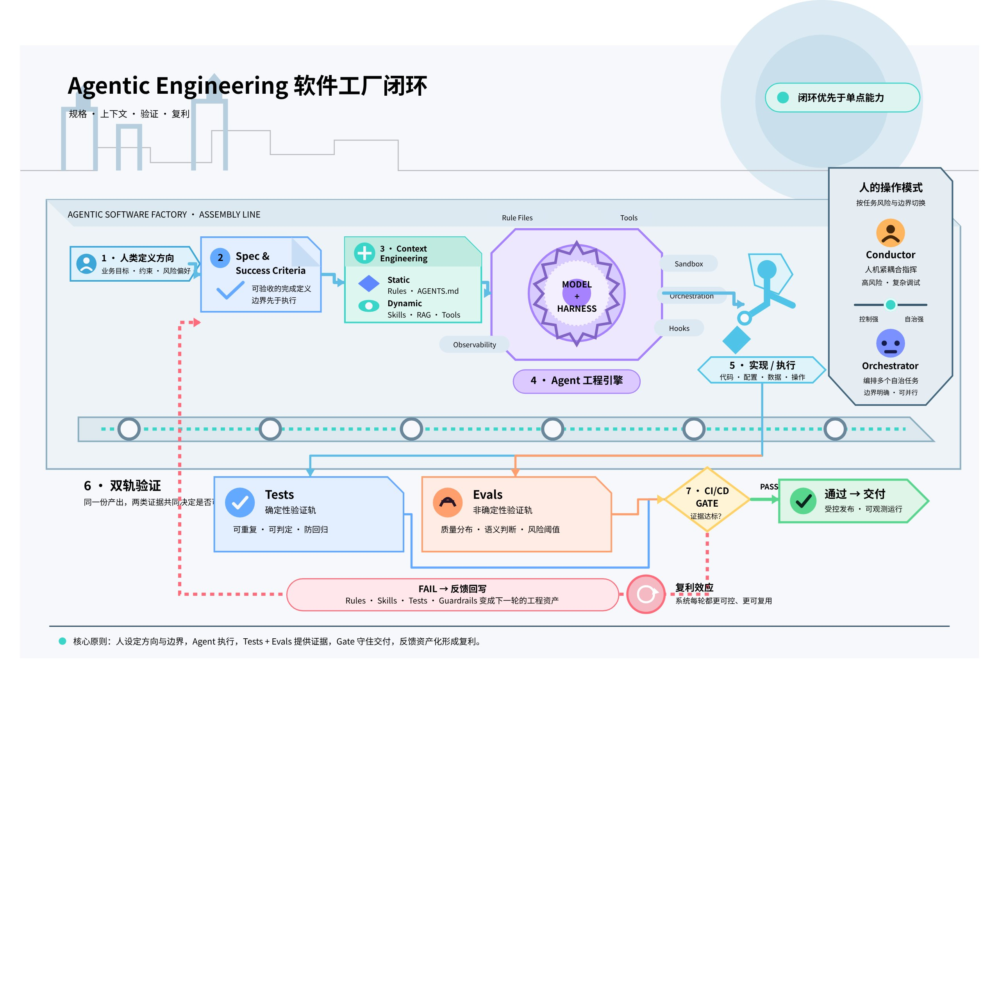

# 从 Vibe Coding 到 Agentic Engineering：把 AI 编程升级为可验证、可复利的软件工厂

AI 已经能快速生成代码，但“生成得快”不等于“可以放心上线”。真正拉开个人与团队差距的，不再只是选择哪一个模型或写出更华丽的 Prompt，而是能否把意图、上下文、工具、验证、反馈与约束组织成一套稳定运行的工程系统。

> 💡 **核心结论：**代码生成正在成为基础能力；验证、判断与方向，才是新的工程手艺。模型会持续迭代，但沉淀在版本控制中的 rules、skills、tests、evals 与 workflows，会成为长期复利的团队资产。

AI 编程已经从少数人的实验变成主流开发方式：一些行业调查显示，约 85% 的专业开发者正在使用 AI Coding Agent，约 41% 的新增代码由 AI 参与生成。争论也随之出现——同一个“Vibe Coding”，往往被用来描述完全不同的开发纪律与风险水平。

真正值得讨论的，不是 AI 能不能写代码，而是如何把生成能力组织成一套可验证、可治理、可长期复利的工程系统。下文从开发方式光谱、Context Engineering、Harness、人的角色与 Token Economics 五个层次展开。

## 1. Vibe Coding 与 Agentic Engineering 不是二选一

2025 年 2 月，Andrej Karpathy 用 “Vibe Coding” 描述一种顺着感觉推进的开发方式：用自然语言告诉 AI 想要什么，不仔细阅读生成代码，遇到错误就把报错交给 AI 继续修。这个词迅速流行，也因为被过度泛化而失去边界。到 2026 年初，“Agentic Engineering” 开始被用来描述更有纪律的一端。

两者不是互斥标签，而是一条连续光谱：一端是顺着感觉快速试错，中间是结构化的 AI 辅助开发，另一端是由规格、约束和验证驱动的生产级工程。判断标准不是是否使用 AI，而是 AI 输出周围有多少结构、验证与人类判断。

| 维度 | Vibe Coding | 结构化 AI 辅助开发 | Agentic Engineering |
|-|-|-|-|
| **意图表达** | 随口描述、边做边改 | 任务说明、局部约束、人工把关 | 正式 Spec、架构文档、Memory Files |
| **验证方式** | “看起来能跑” | 人工 Review + 部分自动化测试 | Tests、Evals、CI/CD Gates、质量门禁 |
| **错误处理** | 把报错贴回去，让 AI 再修一次 | 人工定位，AI 辅助修改 | Agent 在既定边界内自诊断，人处理架构问题 |
| **适用场景** | 原型、一次性脚本、低风险探索 | 常规功能、内部工具 | 生产系统、支付、安全与高风险业务 |

因此，关键问题不是“有没有使用 AI”，而是 AI 输出周围有多少结构、验证与人类判断。周末做一个随时可以推倒重来的原型，Vibe Coding 很合理；处理真实资金的生产 API，则必须靠清晰约束与可重复验证来兜底。

### 1.1 真正的分水岭是验证

验证分成两类。**Tests** 负责确定性行为，例如给定输入后函数必须返回明确结果；**Evals** 负责非确定性行为，例如 Agent 是否走了合理路径、是否选对工具、最终产出是否达到质量标准。前者验证代码，后者验证系统行为。

这也是从 Vibe Coding 走向 Agentic Engineering 的最低门槛：没有 Tests 与 Evals，再精致的 Prompt 也只是把试错过程写得更漂亮，并没有建立可靠性。

## 2. Context Engineering：比 Prompt Engineering 更重要的能力

Prompt Engineering 关注“这一句话怎么写”；Context Engineering 关注“为了完成任务，Agent 在当前时刻应该知道什么”。可以把它类比为新员工入职：你不会只告诉新人“把这个功能做出来”，还会提供项目背景、技术栈、团队规范、可用工具和不能触碰的边界。

一个完整的 Context 通常包含六类信息：

| 类型 | 作用 | 常见载体 |
|-|-|-|
| **Instructions** | 定义角色、目标和行为边界 | System Prompt、AGENTS.md、CLAUDE.md |
| **Knowledge** | 提供领域与项目知识 | 架构文档、业务 Wiki、代码说明 |
| **Memory** | 保存短期状态与长期经验 | 会话状态、历史决策、偏好与运行记录 |
| **Examples** | 展示期望行为与产出形态 | Golden Cases、模板、Few-shot 示例 |
| **Tools** | 定义 Agent 可以采取的行动 | Functions、MCP Servers、CLI、API |
| **Guardrails** | 建立不可绕过的硬约束 | 权限、Sandbox、审批、策略检查 |

### 2.1 Static Context 与 Dynamic Context

**Static Context** 每次任务都会加载，例如系统指令和规则文件。它可靠，但所有任务都会支付 Token 成本。**Dynamic Context** 按需加载，例如 Skills、RAG 召回文档和工具结果。它更便宜、可扩展，但风险是 Agent 在应该检索时没有检索。

哪些知识必须常驻，哪些知识按需加载，本质上是一项架构决策，应当像代码一样被 Review、版本控制和持续评估。一个实用原则是：高频、短小、违反后果严重的规则放 Static；低频、专业、体量大且可明确触发的知识放 Dynamic。

### 2.2 Agent Skills 与渐进式披露

管理 Dynamic Context 的关键模式是 **Progressive Disclosure**。Agent 启动时只看到 Skill 的简短元数据；任务匹配后才加载完整指令；确实需要时再读取深层参考资料。这样，一个通用 Agent 可以携带几十种专业能力，却只为当前任务支付 Context 成本。

Skill 不是一次性 Prompt，而是可复利的工程资产。每次发现输出走偏，都应把原因修回 Skill；同时保持模块化与可维护性，避免把所有知识堆进一份难以审计的超长文件。

## 3. AI 正在重写软件开发生命周期

传统 SDLC 从需求、设计、实现、测试一路延伸到部署与维护。AI 对这条链路的压缩并不均匀：实现阶段可能从数周缩短为数小时，但需求访谈、架构取舍和质量判断仍然接近人的速度。因此，瓶颈没有消失，而是从“写代码”迁移到了“定义正确的问题并证明结果正确”。

需求阶段正从部门之间传递文档，转向人和 AI 共同把访谈快速变成 Spec 与原型；架构阶段依旧依赖人类，因为一致性与可用性、自研与采购等取舍需要完整的商业语境；实现阶段从手写转向 Review、引导和验证；维护阶段则因为 Agent 能阅读既有 Codebase、识别模式而出现新的自动化空间。

### 3.1 生产力提升与验证成本同时存在

行业调查常见的结论是，AI 能让实现阶段的生产力提升约 25%–39%；但 METR 的一项研究也发现，资深工程师在某些任务中使用 AI 反而慢了约 19%，时间主要消耗在验证和修正产出上。这两组数字并不矛盾：AI 没有消灭实现工作，而是把实现从“写”迁移为 Review、引导与验证。

这也解释了为什么 Spec 质量会成为新的瓶颈。实现越快，错误理解被放大的速度也越快；如果需求、边界和验收标准不清楚，生成能力只会让团队更快地到达错误结果。

### 3.2 工厂模型：开发者的产出不再只是代码

Factory Model 把软件开发看成一座工厂。开发者不再亲手组装每一个零件，而是设计产线、定义质量标准、处理异常并持续改进系统。此时，开发者的主要产出不是某一段代码，而是一个能够稳定产出合格代码的系统。

这座软件工厂由六类要素构成：Spec 与 Context 定义成功标准；Agents 负责执行；Tests 与 Evals 验证确定性和非确定性结果；CI/CD Gates 决定是否放行；Feedback Loops 把失败带回修正；Guardrails 限制行为边界。人的职责是设定方向、做关键判断，并把每一次失败转化为系统改进。

## 4. Agent = Model + Harness

把 Agent 的表现全部归因于底层模型，是 AI 工程中最常见的误区。一个 Raw Model 只有生成能力；当它获得状态、工具、反馈回路和可执行约束之后，才成为能够完成工作的 Agent。更准确的公式是：

**Agent = Model + Harness**

Context Engineering 像新员工入职培训，Harness Engineering 则是整家公司如何运作：IT 基础设施、流程规范、权限门禁、质量体系与绩效反馈都包含在内。

| Harness 组件 | 解决的问题 | 典型实现 |
|-|-|-|
| **Rule Files** | Agent 是谁、重视什么、绝不能做什么 | AGENTS.md、策略文件、代码规范 |
| **Tools** | Agent 能做什么，以及何时调用 | Functions、MCP、CLI、服务 API |
| **Sandbox** | 代码在哪里运行、资源能否访问 | 容器、权限隔离、审批边界 |
| **Orchestration** | 任务如何拆分、路由与交接 | Sub-agents、模型路由、工作流状态机 |
| **Hooks** | 把“绝不能忘”的动作确定性执行 | 提交前密钥扫描、格式检查、质量门禁 |
| **Observability** | 判断 Agent 做得好不好、贵不贵 | Logs、Traces、Evals、成本监控 |

### 4.1 同一个模型，换一套 Harness，表现可以天差地远

两类案例说明了 Harness 的杠杆效应：在 Terminal Bench 2.0 这类高难度 Coding Agent Benchmark 中，有团队不更换模型，只调整 Harness，就把排名从 30 名之外提升到前 5；LangChain 的一项实验也显示，同一模型仅调整 System Prompt、Tools 与 Middleware，得分提升了 13.7 分。

这意味着 Agent 失败大多首先是 Configuration 问题：缺少工具、规则含糊、Guardrail 不完整、Context 噪声过高，或 Observability 无法暴露真正的失败点。换模型可以提升能力上限，但 Harness 决定这颗“脑”在什么环境中工作、能否稳定兑现能力。

Agent 出包时，第一反应不应是立刻换模型。更有效的排查顺序是：是否缺少工具？规则是否含糊？Guardrail 是否缺失？Context 是否充满噪声？反馈回路是否能定位失败？修完 Bug 后，再多花几分钟把改进写回 Harness，错误就会从一次性成本变成可复用资产。

## 5. 人的角色：在 Conductor 与 Orchestrator 之间切换

| 模式 | 工作方式 | 适用任务 |
|-|-|-|
| **Conductor** | 在 IDE 中持续观察、随时纠偏，理解每一处改动 | 复杂逻辑、棘手 Debug、不熟悉的 Codebase、高风险变更 |
| **Orchestrator** | 定义目标并分派任务，Agent 后台执行，人定期 Review | 边界明确的 Bug Fix、模式化功能、迁移、测试生成 |

成熟的工程师不会固守一种模式，而会根据风险、熟悉度和可验证性来切换。Orchestrator 模式尤其依赖四项能力：**Specification**，把任务定义到不易误解；**Decomposition**，把大任务拆成单个会话可完成的规模；**Evaluation**，快速判断产出是否过关；**System Design**，设计约束、测试和反馈回路。

## 6. Token Economics：为什么前期投入会降低长期成本

Vibe Coding 的 CapEx 很低：一个订阅、几句 Prompt 就能开工。但低前期投入往往隐藏三种持续增长的 OpEx。

1. **Token 燃烧率。**未经整理的 Context 被整包输入，模型在低成功率的试错循环中反复修复自己未验证的错误。
2. **维护税。**结构不一致的 AI 代码在数月后暴露问题，工程师需要重新理解缺乏设计意图的实现。
3. **安全补救成本。**生成速度越快，未经门禁进入生产环境的漏洞也越多，而生产阶段修复通常远比设计阶段发现昂贵。

Agentic Engineering 则反过来：前期投入时间设计 API Schema、测试套件、Context 与 Guardrails，CapEx 更高；但 Agent 在治理良好的“工厂”中运行，First-pass 成功率提升，每个后续功能的边际成本下降。

Context Engineering 因而不仅是技术问题，也是财务杠杆。你无法控制模型厂商的价格，但可以通过更精准的 Context、更高的首轮成功率和更短的试错链路，用更少 Token 完成同样任务。

## 7. 可直接落地的行动清单

### 7.1 个人开发者

1. 从十行左右的 `AGENTS.md` 或 `CLAUDE.md` 开始，写清技术栈、惯例、硬规则与工作流。
2. 每当 Agent 做出一次不想再看到的行为，就补一条规则、示例或自动化检查。
3. 在生成代码之前先写 Tests 与 Evals，把它们当作你与 AI 之间可执行的合同。
4. 所有准备上线的代码都要 Review，尤其检查“看起来很聪明”的实现、依赖和边界条件。
5. 保留 Debug、系统设计和架构判断基本功；AI 放大专业能力，不替代专业能力。

### 7.2 团队与技术负责人

1. 把 AI 开发视为工程投资，而不是只购买一个“生产力功能”。Coding Agent 必须配套 Evals、Observability 和架构标准。
2. 把 Harness 作为团队公共资产：System Prompts、Skill 库、Eval 套件与工作流全部版本化、Review，并明确维护责任。
3. 建立失败回写机制：线上问题、Badcase 和人工纠偏都要沉淀回 Rules、Skills、Tests 或 Guardrails。
4. 重新定义人才能力模型：从“写最多代码”转向“能定义方向、拆解任务、验证结果并指挥 Agent”。

## 8. 结语：投资可控、可迁移、会复利的部分

模型几个月就会更新一代，团队永远追不完排行榜；但 Harness 是你真正可控的部分。它与单一模型解耦，可以随着模型升级水涨船高，也能在团队和项目之间迁移。

> Generation is solved. Verification, judgment, and direction are the new craft.

对工程师而言，未来的核心竞争力不是让 AI 多写几行代码，而是建立一套系统，让 AI 在正确的上下文中，使用正确的工具，遵守明确的边界，并通过可重复的证据证明结果可靠。

---

## 延伸阅读

- Google 官方课程介绍：[Join the new AI Agents Vibe Coding Course from Google and Kaggle](https://blog.google/innovation-and-ai/technology/developers-tools/kaggle-genai-intensive-course-vibe-coding-june-2026/)
