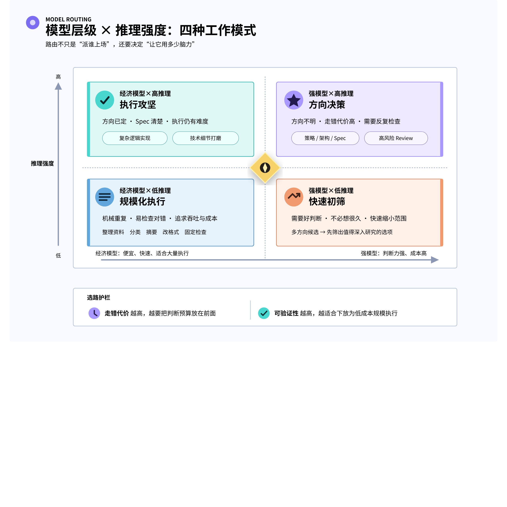
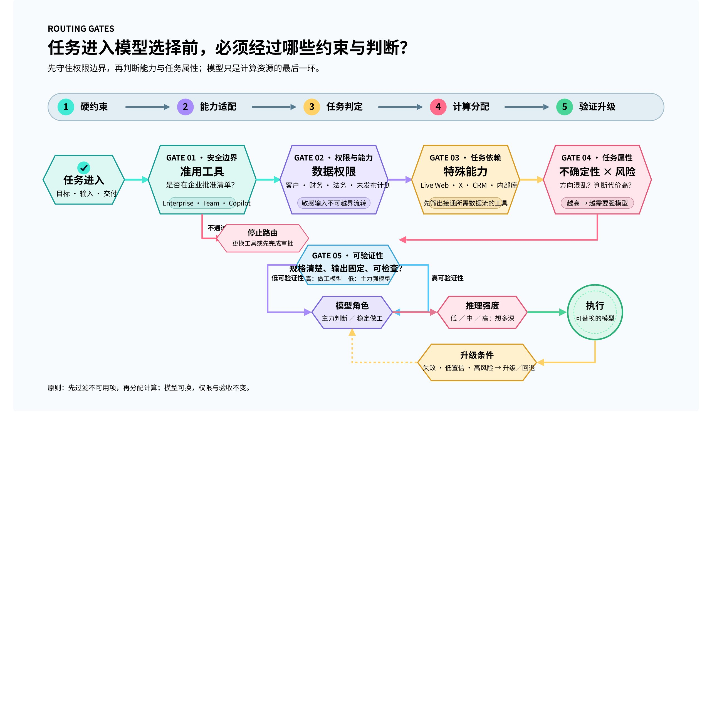
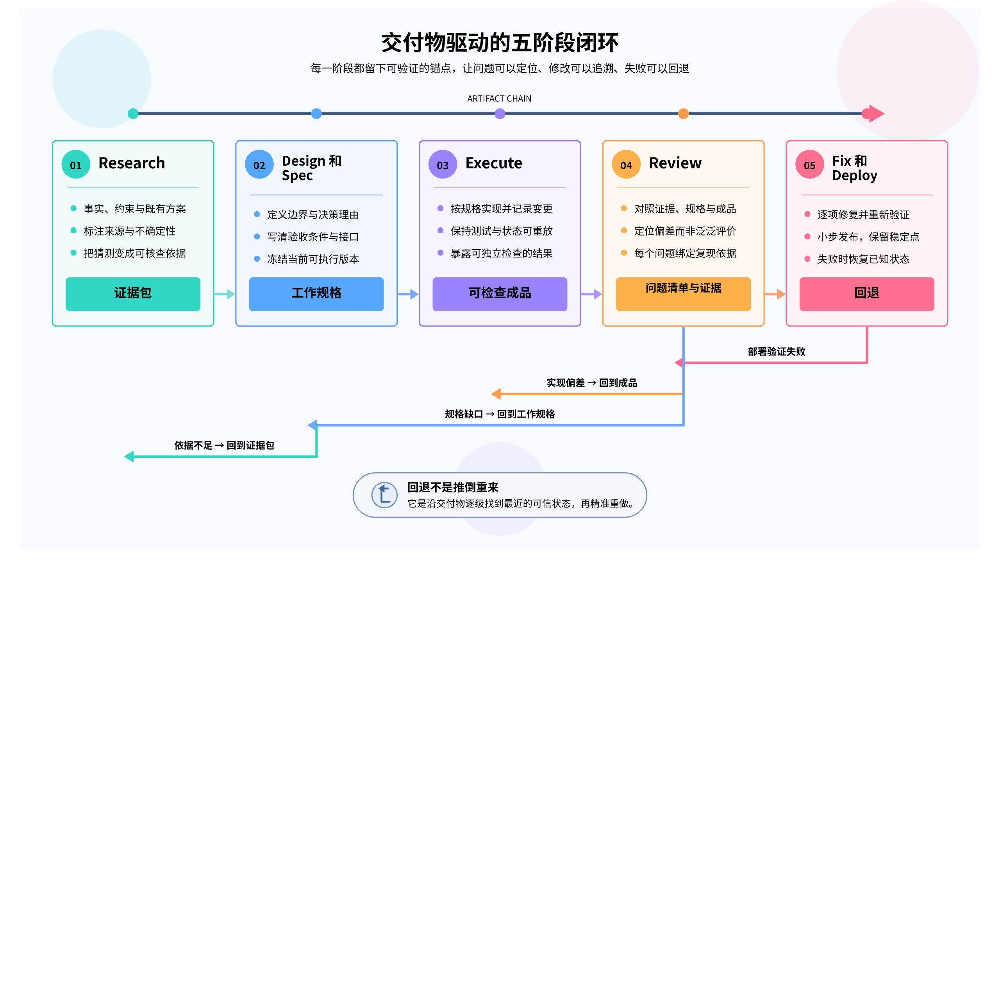
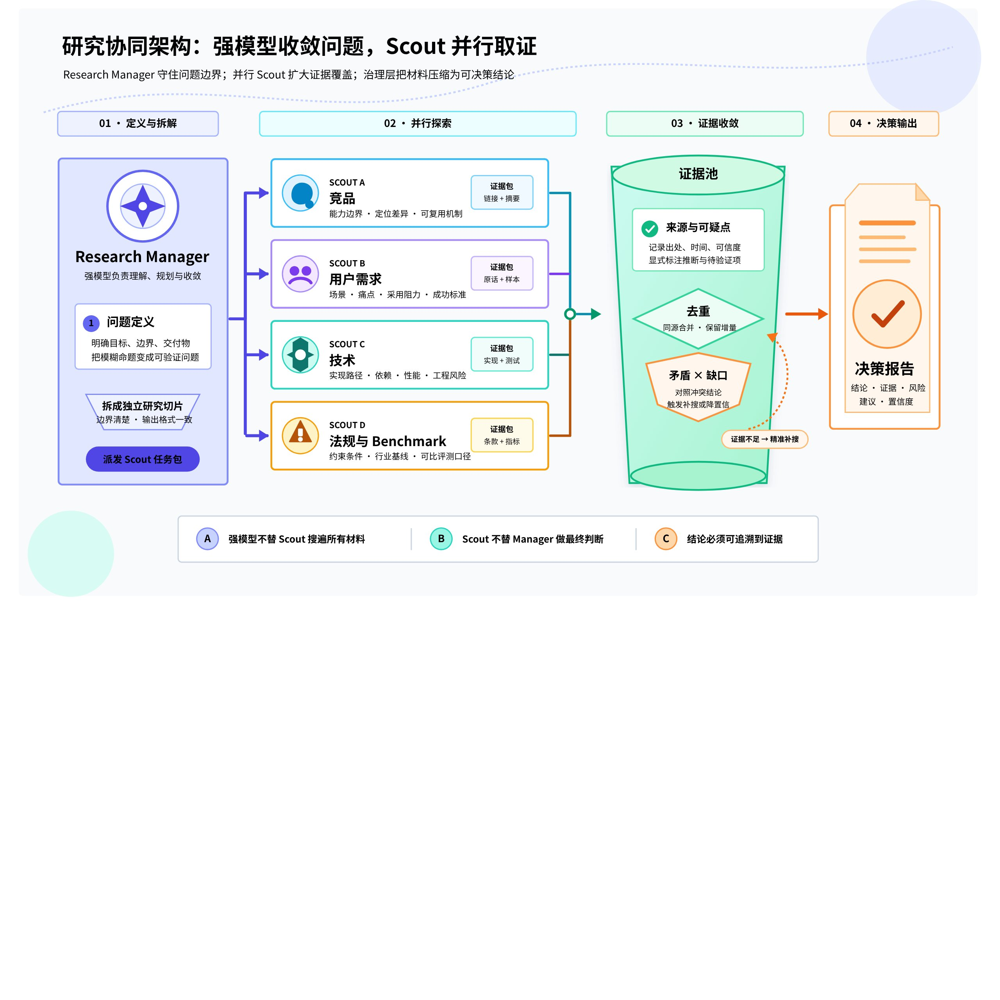
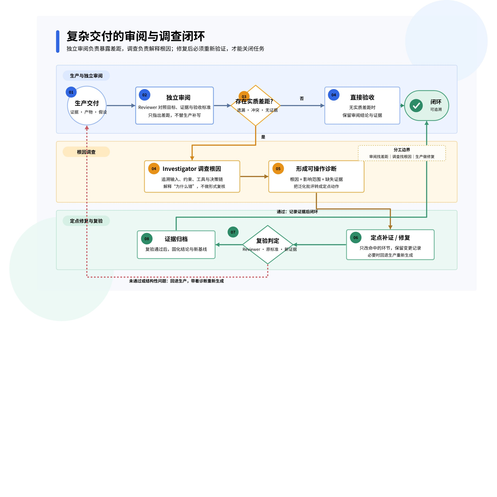
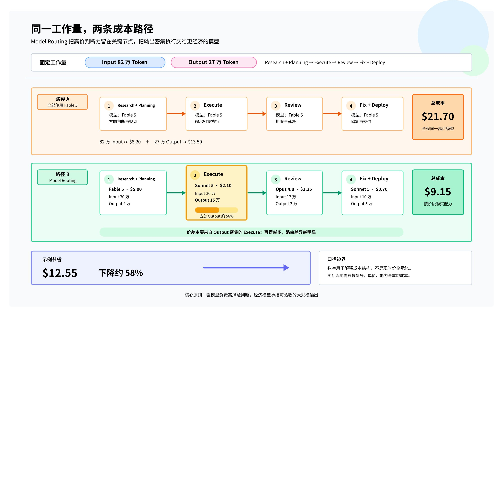

# 把 AI 成本花在刀刃上：Model Routing 的任务分工、交付链与升级机制

AI 工作流真正昂贵的，往往不是某一次调用，而是把最高单价的判断力铺在所有步骤上：方向尚未明确时需要它，格式转换、批量整理和固定检查时却未必需要。Model Routing 的核心不是追逐模型排行榜，而是做 **Compute Allocation（算力分配）**：依据每一步的不确定性、输出量、风险与可验证性，决定应购买多少模型能力和推理预算。

> 💡 **核心判断：**把强模型和高推理留给“走错代价高”的决策点，把规则清楚、可验证、输出密集的工作交给更经济的模型；同时用明确交付物和升级条件，避免省下单价却增加重跑与人工检查。

## 1. Model Routing 不是 Model Selection

Model Selection 只问“派谁上场”，Model Routing 还要问“让它思考多深”。前者对应模型层级，后者对应推理强度。模型层级与推理强度是两个独立旋钮，组合后形成四种工作模式。

### 1.1 两个旋钮，而不是一个排行榜

| 组合 | 适用任务 | 判断依据 |
|-|-|-|
| 强模型 × 高推理 | 产品策略、系统架构、重要 Spec、高风险 Review | 方向不明，走错代价高 |
| 强模型 × 低推理 | 多方案初筛、快速判断研究价值 | 需要判断质量，但无需长链推理 |
| 经济模型 × 高推理 | 按既有规格实现复杂逻辑 | 方向已定，技术细节仍有难度 |
| 经济模型 × 低推理 | 分类、摘要、格式转换、固定检查 | 机械重复，错误容易识别 |

这四种组合不是固定模型名单。模型能力、价格和平台政策都会变化，稳定不变的是任务属性：未知程度、错误代价、输出规模与验收难度。

### 1.2 路由不是先选模型：先过两道硬门槛

**第一道门槛是公司准用的工具与数据权限。**客户资料、财务资料、法务草稿和未发布计划能否进入某个平台，优先级高于性价比。准用范围内再讨论模型强弱，不能用“便宜”替代合规判断。

**第二道门槛是任务需要的特殊能力。**有些工作依赖 Live Web、X、公司数据库、CRM、历史资料库或其他专有数据流。此时关键不是抽象排行榜，而是模型或工具是否真正连接到所需来源。

两道限制是公司准用的工具与任务需要的特殊能力。过完两道限制，才进入任务判断：方向是否明确、风险多高、输出量多大、成果是否容易验证。若便宜模型遇到证据冲突、超出 Spec 或高风险问题，升级条件必须让它停下并把工作退回强模型或人。

## 2. 优化目标是可交付总成本，不是最低单价

同一份工作中，不同步骤需要的“智力密度”并不相同。以网站建设为例，早期要理解受众、竞争环境、页面架构和成功条件；方向确定后，大量 Token 消耗反而发生在读写代码、修改页面、运行测试和修复缺陷。如果全程使用最高单价模型，就把最贵的判断力套在了输出量最大的阶段。

因此，完整成本至少包含四部分：**Token 成本、重跑次数、人工检查时间、方向走错代价**。便宜模型在没有清晰 Spec 时连续重跑，可能比一次正确决策更贵；强模型长期执行格式整理，则是在浪费昂贵判断力。Model Routing 的目标不是把模型单价压到最低，而是以合理成本得到真正可用的成品。

| 成本项 | 常见浪费 | 控制手段 |
|-|-|-|
| Token 成本 | 高价模型承担批量输出 | 把输出密集阶段路由给经济模型 |
| 重跑次数 | Spec 模糊导致反复返工 | 先定义输入、输出和 Success Criteria |
| 人工检查时间 | 成果不可验证，只能逐项人工猜测 | 把验收方式写进工作包 |
| 方向走错代价 | 早期判断错误，后续越做越远 | 关键决策点使用强模型、高推理或人 |

## 3. 把任务拆成可交接的五阶段闭环

把工作简单切成五段还不构成 Routing。真正的关键是交接：Research 交出证据包，Design 和 Spec 交出工作规格，Execute 交出可检查成品，Review 交出问题清单与证据，Fix 按清单修复后才进入 Deploy。每一步的 Output 都必须成为下一步的 Input，出现问题时才能定位应退回哪一层。

### 3.1 Research：强模型掌舵，Scout 并行取证

研究不应把搜索、判断和结论全部压在同一个对话中。更稳的做法是让强模型担任 Research Manager：定义问题、拆研究子题、指定来源类型，并提前说明每项结论需要什么证据。随后由成本较低的 Scout Agents 并行搜集竞品、用户需求、技术方案、法规、案例、GitHub 项目或 Benchmark。

Scout 的职责是返回来源、重点和可疑点，而不是抢先宣布最终结论。资料回流后，Research Manager 再负责去重、识别矛盾、补齐缺口，最终整理成能支持决策的报告。这样把开头的问题定义和结尾的证据收敛留给强模型，中间大量可拆分搜集则具有替换空间。

### 3.2 Design 和 Spec：把判断变成交接契约

Spec 的标准不是“写过了”，而是换一个模型、换一个人，甚至间隔两周后仍能明确交付什么、如何判断完成。一份可执行 Spec 至少应说明页面或模块、目标对象、数据来源、设计原则、Success Criteria，以及明确的禁止事项。

例如，“首页三秒内让首次到访的 SaaS 创办人理解产品卖点”“案例页能看到导入前后的差异”，都比“做一个好看的网站”更容易执行和验收。由于此阶段暴露的是尚未想清楚的部分，通常适合强模型和较高推理强度。

### 3.3 Execute：只把可验收的工作大规模下放

Spec 清楚后，可以把页面、文案整理、数据转换、代码和测试准备拆成独立工作包。每个工作包要写清 Input、Output、不能碰的边界和完成判据。产品资料转 JSON、补 Metadata、按既有组件套版、整理 CSV 等规则固定的工作，可使用经济模型和低推理；按清晰规格补复杂逻辑，则可使用经济模型但提高推理强度。

判断标准很直接：**能够验收的事情，才适合交给更经济的模型大量执行。**如果团队自己都说不清“什么叫好”，低成本生成只会快速积累不敢使用的产物。

### 3.4 Review：把检查升级为 Investigation

Review 不是泛泛地“看看有没有问题”，而是一场 Investigation：先定义要调查什么、需要什么证据、什么条件算通过。网站场景可能包含速度、SEO、Accessibility、Broken Links、事实与引用、表单提交、移动端和主要用户流程。

多个 Checker 可以分头调查，但只回报证据、失败项和可疑点，不各自宣布是否上线。全部结果回到统一裁决者后，再判断严重性、是否退回修改、哪些风险可以接受、哪些必须交给人。一般初检可以使用经济模型；证据冲突，或涉及安全、法务、监管与商业决策时，应提高推理强度并触发人工介入。

### 3.5 Fix 和 Deploy：局部修复可以下放，方向错误必须升级

Review 已提供明确问题清单后，局部修改代码、补格式、重跑测试和部署通常可交给经济模型。但一旦发现问题来自 Spec 本身，而不是实现偏差，就不能继续在错误方向上打补丁；工作必须升级回强模型，重新处理需求与方向。

## 4. 算一笔账：为什么路由主要省在输出密集阶段

下面保留一组中型营销网站的示例口径，用于解释成本结构，不代表当前实时价格。假设 Research 和 Planning 使用 30 万 Input Token、4 万 Output Token；Execute 使用 30 万 Input、15 万 Output；Review 使用 12 万 Input、3 万 Output；Fix 和 Deploy 使用 10 万 Input、5 万 Output。总计为 **82 万 Input Token 和 27 万 Output Token**。

| 阶段 | Input | Output | 路由示例 | 成本示例 |
|-|-|-|-|-|
| Research 和 Planning | 30 万 | 4 万 | Fable 5 | 约 5 美元 |
| Execute | 30 万 | 15 万 | Sonnet 5 | 约 2.1 美元 |
| Review | 12 万 | 3 万 | Opus 4.8 | 约 1.35 美元 |
| Fix 和 Deploy | 10 万 | 5 万 | Sonnet 5 | 约 0.7 美元 |

按示例中的标准 API 单价，全部使用 Fable 5 时，82 万 Input 约 8.2 美元，27 万 Output 约 13.5 美元，总计 21.7 美元。采用 Model Routing 后，总计约 9.15 美元，**从 21.7 美元降到 9.15 美元，少 12.55 美元，下降约 58%**。

价差主要出现在 Execute，因为 Output Token 通常更贵，模型写得越多，路由差异越明显。但 58% 不是普遍保证：如果 Spec 质量差，或经济模型无法胜任，只要重跑一次，就可能抵消节省的费用和时间。

## 5. 把概念落成一张可执行路由表

选择一个最常重复的工作流，为每一步记录以下字段。缺少其中任何一项，路由都容易退化成“凭感觉换模型”。

| 字段 | 要回答的问题 |
|-|-|
| Input | 需要哪些资料、上下文和权限？ |
| Output | 必须交出什么结构、文件或证据？ |
| 错误代价 | 做错后影响多大，是否会污染后续阶段？ |
| 验收方式 | 格式、测试、链接、字段或事实如何检查？ |
| 模型层级 | 需要策略判断，还是稳定执行？ |
| 推理强度 | 需要快速处理，还是多步推理与复核？ |
| 升级条件 | 何时必须停下，退回强模型或交给人？ |

OpenRouter 这类平台可以把多种模型放进统一的按量计费 API 入口，但它只解决“接到哪里”，不会自动完成任务拆解、交接设计和质量控制。不同模型对 Tool Use、特殊参数、数据政策与客户端兼容性的支持并不一致；用于公司或客户数据前，仍要确认隐私设置、准用范围和实际兼容性。

## 6. 结论：建立可替换的系统，而不是追逐单一模型

成熟的 Model Routing 架构应满足五个条件：任务可以拆、模型可以换、数据权限清楚、验收标准存在、出错可以回退。模型、价格和平台政策会持续变化，但这五项使工作流不必跟着排行榜反复重做。

真正需要管理的不是模型名称，而是每一步的不确定性、输出量、风险和可验证程度。AI 让执行越来越便宜以后，稀缺能力会转向定义问题、拆解工作、设计证据、设置升级边界，以及判断哪些决定不能直接交给 AI。算力分配的本质，就是为每一步购买刚刚好的智力。
