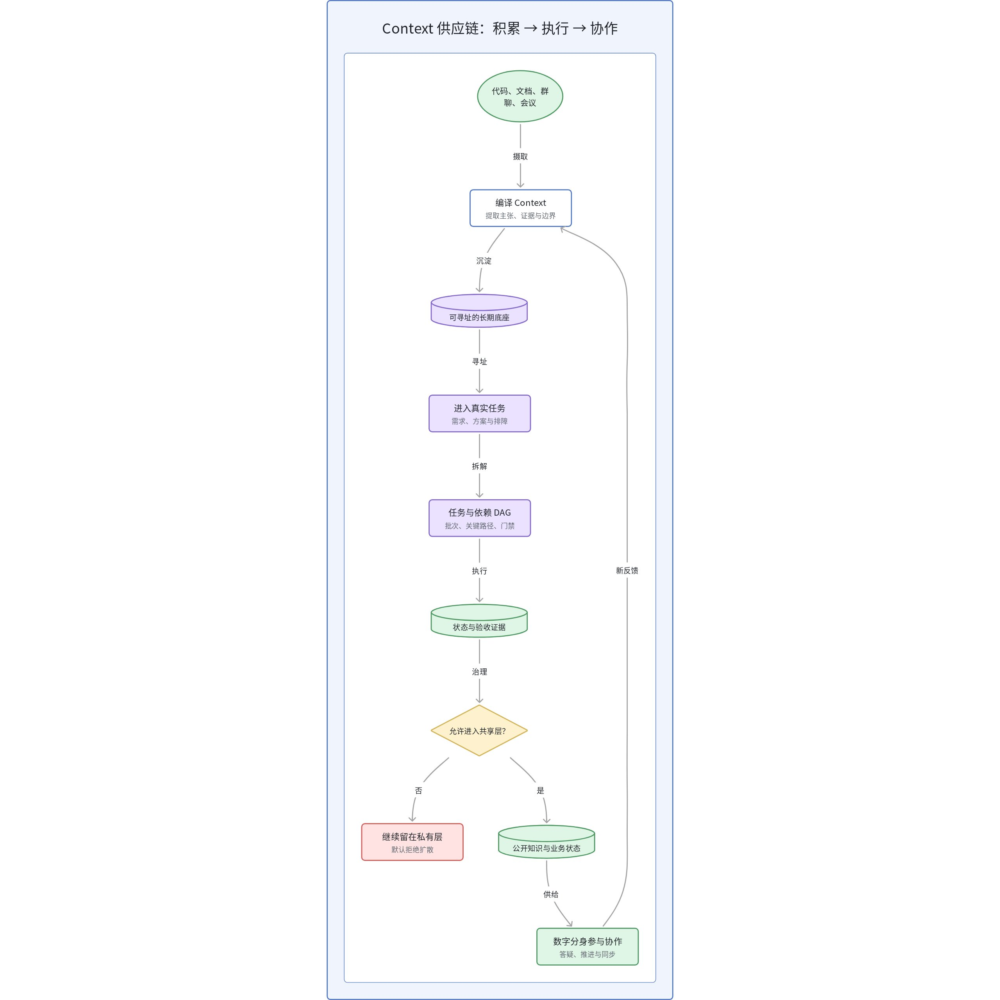
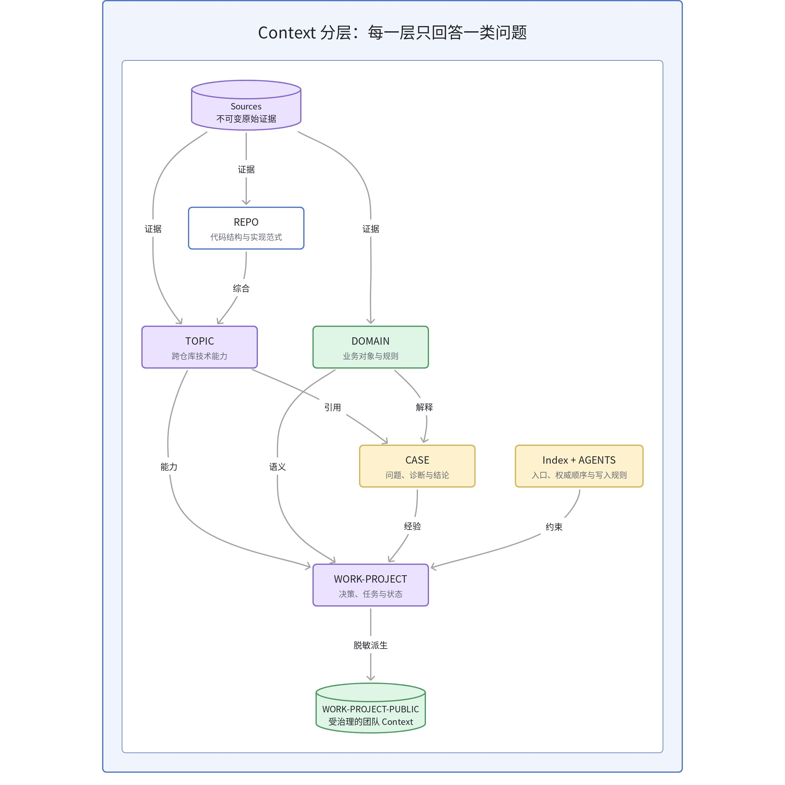
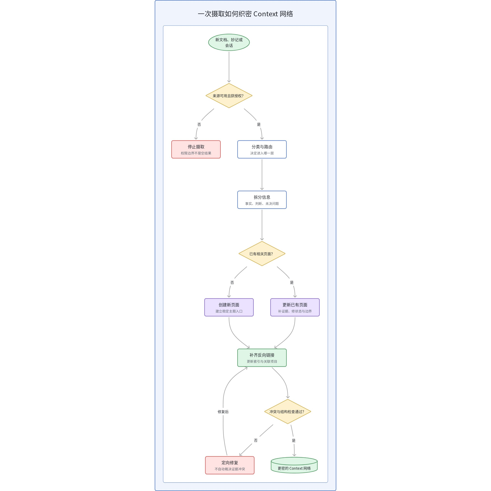
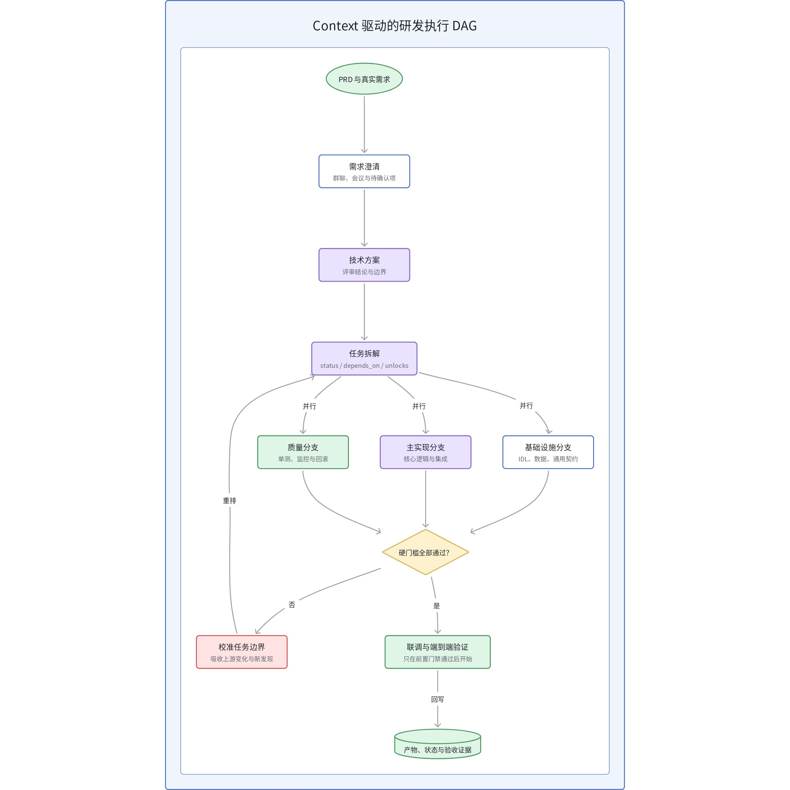
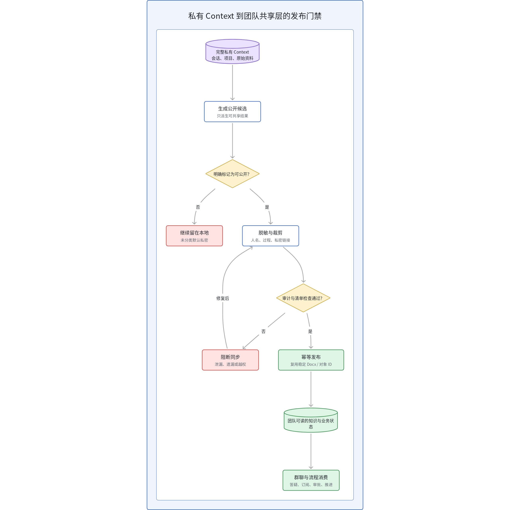
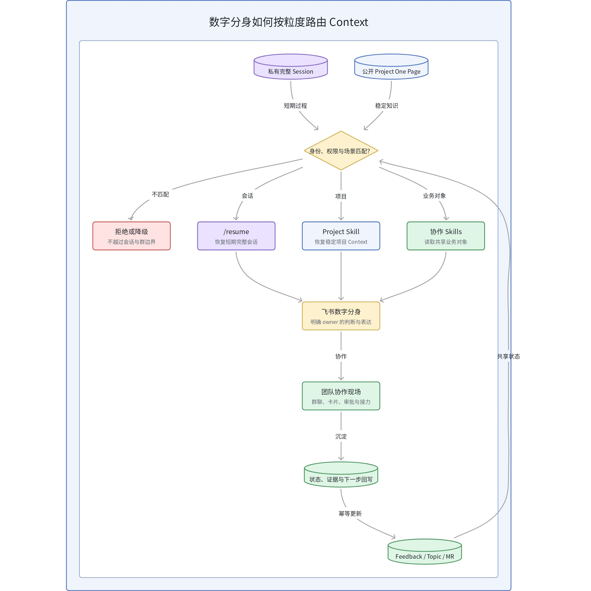

# 让 Context 流动起来：从个人知识底座到团队数字分身

很多人把 Agent 的上限归因于模型能力、工具数量或 Prompt 技巧。但在真实工作里，更常见的瓶颈是另一件事：信息散落在代码、需求文档、群聊、会议和历史会话中，Agent 每次接任务都要重新理解；即使做对了一次，结论也没有进入下一次任务；当这些内容需要共享给团队时，又缺少清晰的权限和脱敏边界。

所以，一个真正可持续的数字分身，不是“更会聊天的 Bot”，而是一条能够持续运转的 Context 供应链。它先把碎片编译成可寻址的长期资产，再让这些资产进入开发执行，最后只把经过治理的结果送进团队协作现场。

> **核心原则：** 把对的 Context，在对的时机，送到对的人或 Agent 手里。

| 阶段 | 要解决的问题 | 核心资产 | 常见失败 |
| --- | --- | --- | --- |
| 积累 | 让 Context 有地方落 | 证据、知识页、索引、Schema | 只收藏，不编译；每次重新搜索 |
| 执行 | 让 Context 进入真实任务 | 任务页、依赖 DAG、状态、验收证据 | 会话结束即失忆；忽略依赖顺序 |
| 协作 | 让 Context 安全流向团队 | 公开项目页、共享业务状态、审计记录 | 直接扩散原始会话；权限和责任不清 |

## 1. 先改问题定义：不是知识存储，而是 Context 编译

传统检索擅长从原始资料里临时找到相关片段。它解决的是“这次回答需要什么”。但长期工作上下文还需要多走一步：把已经收敛的主张、证据、适用范围、冲突和交叉引用写回一个可复用产物，让后续任务不必重复完成同一轮理解。

这并不意味着抛弃 RAG。更合理的关系是：RAG 继续承担底层召回，Wiki 或结构化知识层承担编译后的长期语义。一次查询结束后，真正有复用价值的判断会被沉淀；旧结论出现新证据时，也能被修订，而不是留在某个无法寻址的聊天窗口里。

| 维度 | 即时检索 | 编译后的 Context |
| --- | --- | --- |
| 基本单元 | Chunk、搜索结果、临时上下文 | 主张、证据、关系、适用边界 |
| 生命周期 | 服务当前查询 | 跨任务、跨会话持续维护 |
| 冲突处理 | 依赖本次回答临时判断 | 显式标记冲突、状态和待验证项 |
| 复用方式 | 重新召回和拼装 | 先读取已有结论，再回查原始证据 |

## 2. 目录不是文件柜，而是给 Agent 的路由协议

当工作上下文同时包含代码、业务规则、项目状态和排障案例时，把所有内容塞进一个 Wiki 目录很快会失控。真正有效的分层，不是为了看起来整齐，而是让每一层只回答一类问题，并形成稳定的引用方向。

| Context 层 | 主要回答 | 边界 |
| --- | --- | --- |
| Sources | 原始证据是什么 | 尽量不可变；记录来源、日期和可核验范围 |
| REPO | 某个代码库如何实现 | 围绕结构、调用链、约束和范式组织 |
| TOPIC | 跨仓库能力如何工作 | 综合多个实现，但不替代原始代码证据 |
| DOMAIN | 业务对象和规则是什么 | 描述业务语义，不被某次实现细节绑架 |
| CASE | 某个问题如何定位和解决 | 案例引用规则，不能反过来成为规则源头 |
| WORK-PROJECT | 项目现在进行到哪里 | 承载决策、任务、依赖、状态与验收证据 |
| WORK-PROJECT-PUBLIC | 团队可以复用什么 | 只接受经过脱敏、审计和授权的派生内容 |

分层要配合 Schema 才能生效。总索引负责告诉 Agent 从哪里开始，维护规则负责说明哪些内容可以写、哪些证据优先、如何更新反向链接、什么时候必须停止。没有这些约束，目录只是静态文件夹；有了它们，目录才成为 Agent 的寻址协议。

## 3. 每次摄取都应该让 Context 网络更密

AI Native 的知识维护，不应只是“把一份材料总结成一个新文件”。更完整的摄取动作包括：确认来源是否可用，区分事实、判断和未决问题，决定内容应该进入哪一层，更新已有页面或新建页面，再补齐反向链接、索引、状态和时间范围。

这一步的价值在于织网。人手维护最容易只更新当前页面，遗漏相关项目、历史结论和入口索引；Agent 在明确规则下，可以把一次摄取变成一组受控的原子更新。每次新资料进入后，旧页面得到修正，孤立节点减少，后续任务的召回路径也更短。

## 4. Context 底座要进入执行，而不是停在阅读层

知识底座真正产生复利，是从它开始驱动任务的那一刻。一个需求从 PRD 进入后，澄清记录、会议结论和技术方案继续被编译成实施任务；任务之间不只记录“做什么”，还要显式声明依赖、解锁关系、当前状态、产物和验收证据。

实施计划适合做状态总览，但每个任务页才应该是权威源。任务页至少包含 `status`、`depends_on`、`unlocks`、验收标准和证据链接。Agent 开始执行前先读取依赖 DAG，按批次、关键路径和硬门槛推进，避免“挑顺手的先做”破坏真实拓扑。

| 机制 | 解决什么问题 | 使用原则 |
| --- | --- | --- |
| Fork | 让独立子任务并行推进 | 继承主会话背景，但把试错隔离在分支里 |
| 任务文档 | 跨 Session 恢复上下文 | 会话可丢，任务状态、决策和证据不能丢 |
| 主动压缩与 Reload | 避免长会话逐渐失焦 | 在临界点前压缩，重新从权威任务页聚焦 |
| 边界校准 | 吸收上游变更和新发现 | 优先修改受影响任务边界，避免全局返工 |

## 5. 团队共享必须经过一道默认拒绝的发布门禁

个人工作上下文通常包含真实人名、未收敛判断、私密对话、内部链接和执行细节，不能直接镜像到团队空间。安全的做法是保留一份完整私有层，再从它派生公开层。公开层不是副本，而是经过人名泛化、过程裁剪、私密链接删除和内容分类后的可共享产物。

发布策略应当是“未标记即私密”，而不是根据文件名或目录猜测。同步前运行审计：检查是否仍有未分类信息、敏感内容、遗漏的来源清单或越权字段；任一门禁失败就停止发布。通过后再更新既有协作文档或共享业务对象，复用稳定 token 和幂等键，避免每次生成新的孤立副本。

## 6. 数字分身需要两层 Context，而不是一个巨型 Session

多人协作最危险的设计，是让所有人共享一份持续膨胀的完整会话。原始聊天、工具轨迹和临时假设变化快、噪音大，也天然带有权限边界。真正值得跨人共享的，是从过程里蒸馏出来的业务对象：确认事实、当前进展、阻塞点、下一步、责任人和证据。

因此，数字分身可以提供三种不同粒度的入口。**Resume** 恢复某次完整会话，适合短期连续协作；**Project Skill** 恢复稳定项目上下文，并在需要时回查当前代码；**Feedback、Topic 和 MR** 恢复已经治理过的共享业务状态，适合跨群、跨人持续推进。

| Context 类型 | 推荐介质 | 典型内容 |
| --- | --- | --- |
| 私有过程 | 本地笔记、会话存储、SQLite | 原始对话、工具轨迹、临时假设、个人长期记忆 |
| 公开项目知识 | 受治理的 Markdown 与协作文档镜像 | 项目 One Page、公开方案、正式评审结论 |
| 共享业务状态 | 多维表格等结构化协作载体 | case、topic、MR、状态、证据、下一步和责任人 |

## 7. 数字分身和团队级 Agent 的边界

数字分身与团队级 Agent 都能在协作工具里接任务，也都能连接开发环境。真正的区别不在能力列表，而在认知归属、Context 所有权和发言责任。

| 维度 | 个人数字分身 | 团队级 Agent |
| --- | --- | --- |
| 认知归属 | 绑定个人工作记录、判断方式和项目经验 | 绑定团队统一规范、流程和共享知识 |
| 可读范围 | 个人私有 Context 为主，按授权读取团队资料 | 组织空间和团队流程内的受控 Context |
| 谁在说话 | 延续明确的个人视角和责任边界 | 按团队配置和标准流程执行 |
| 主要价值 | 降低跨项目、跨会话和跨协作的切换成本 | 把成功实践纳入可度量、可复制的生产线 |

## 8. 一条可落地的最小路径

1. **先选一个高频工作流。**不要一开始覆盖所有知识。选择一个需要反复解释、跨会话恢复或多人协作的真实场景。
2. **定义 Context Schema。**明确来源层、知识层、项目层和公开层分别回答什么，规定引用方向和权威顺序。
3. **打通摄取与回写。**让新资料不仅生成页面，还能更新反向链接、索引、状态和冲突记录。
4. **接入任务执行。**用任务页、依赖 DAG 和验收证据替代只存在于会话里的计划。
5. **最后建设协作层。**先完成私有与公开的发布门禁，再让 Agent 在群聊和业务状态表中代表个人或团队行动。

可以从几个简单指标判断系统是否真的产生复利：同一个背景需要人工复述多少次；中断几天后恢复项目需要多久；任务是否能沿依赖关系继续执行；共享状态是否能追到证据和责任人；发布门禁拦截了多少不该扩散的内容。

## 结语

数字分身的连续性，不来自一段永不结束的聊天记录，而来自一组可寻址、可验证、可更新、可治理的工作工件。知识底座负责积累，任务系统负责执行，协作层负责把结果送到人面前。三层连起来，Agent 才不只是回答问题，而是能够带着历史判断进入下一次真实工作。

工具和模型都会变化。更稳定的工程问题始终是：Context 存在哪里，谁能够寻址它，什么内容可以流动，以及流动之后由谁负责。

本文给出的是个人知识、任务执行与团队协作之间的工程组织框架，不构成通用效果基准。实际采用时仍需结合团队权限模型、数据分类、协作工具和真实任务评测验证。
