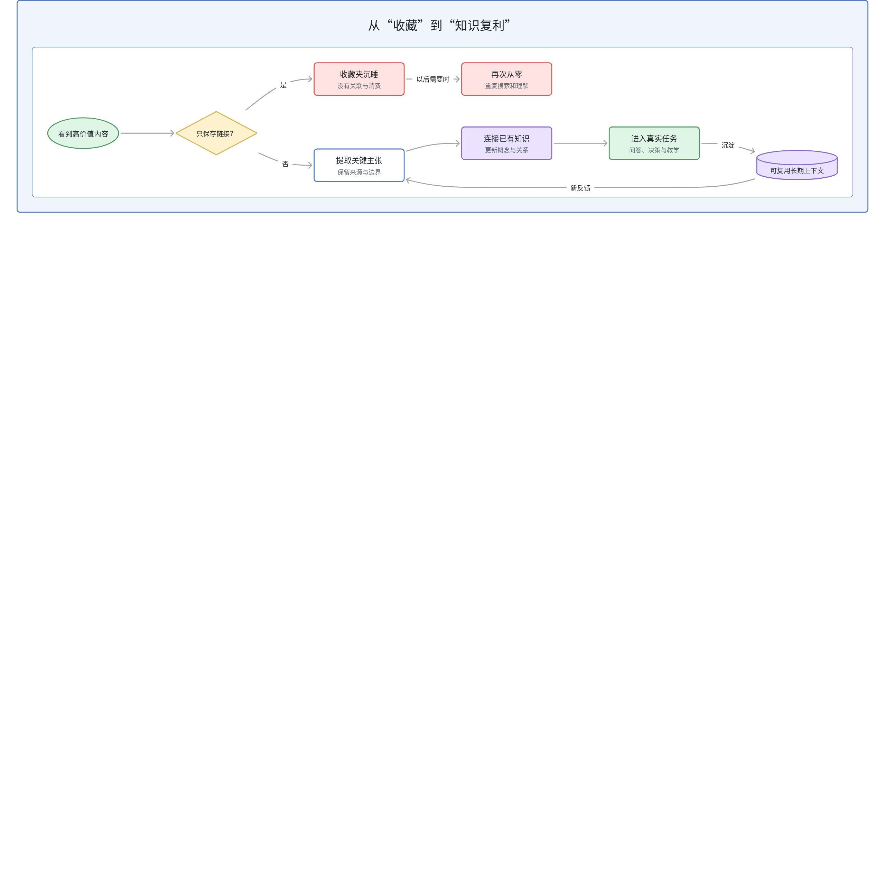
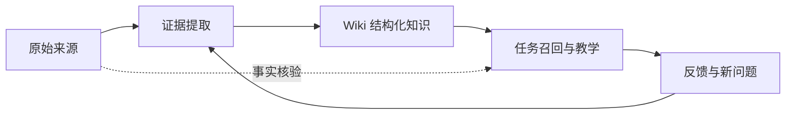
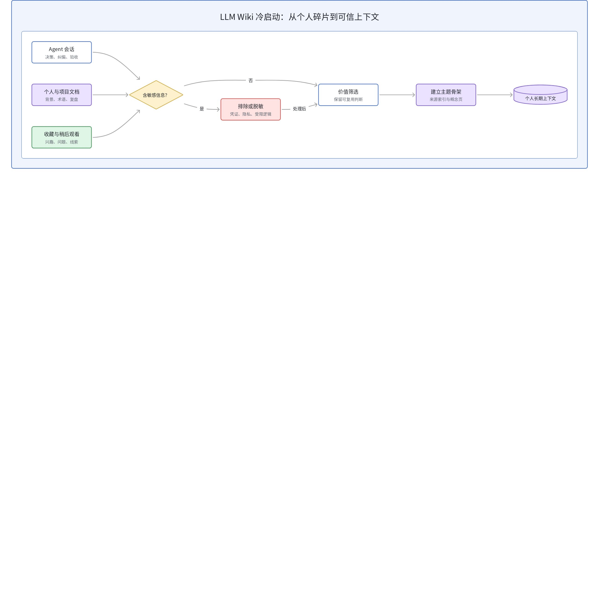
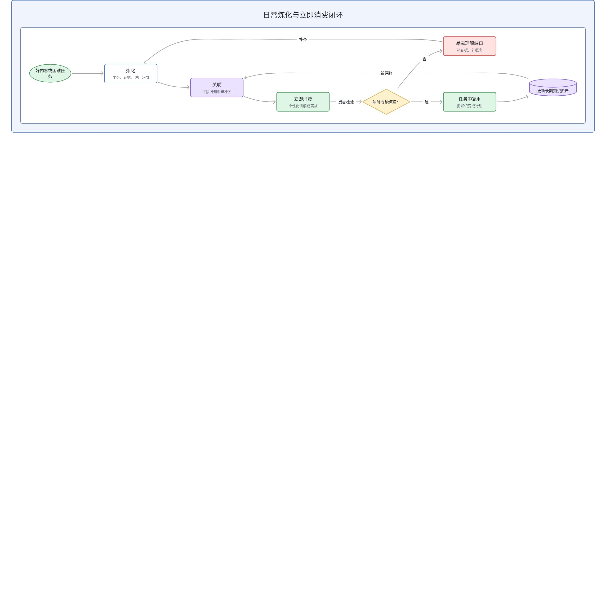
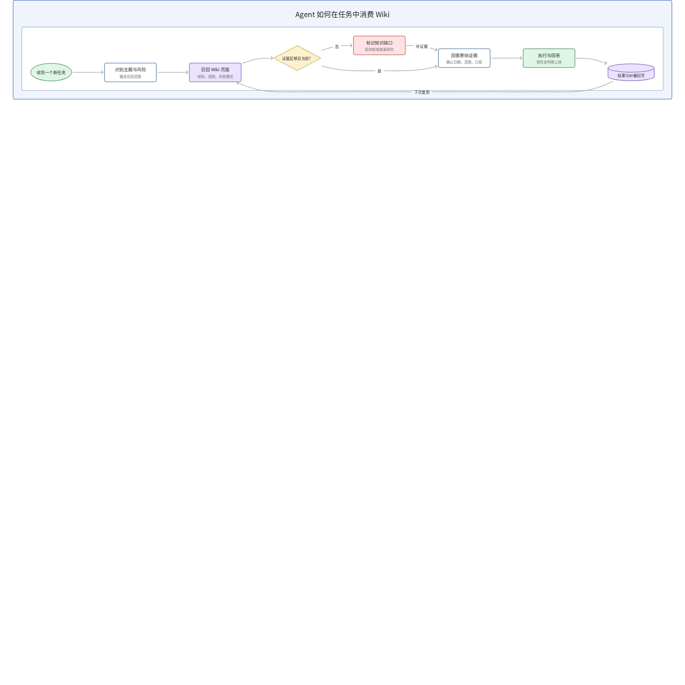
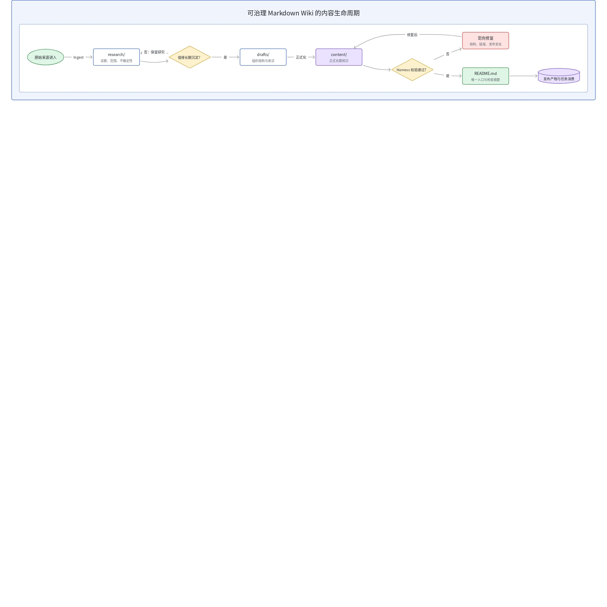
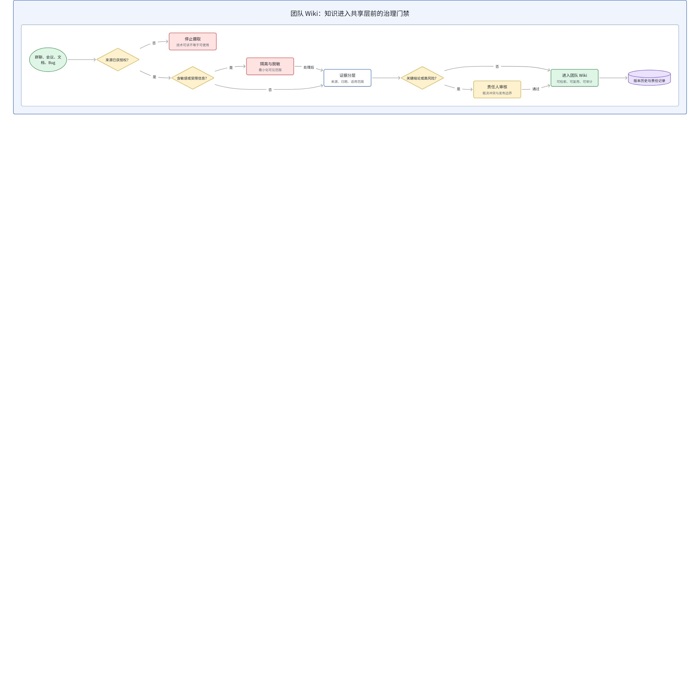

# 从收藏到复利：把 LLM Wiki 做成 Agent 的长期上下文

我们从来不缺知识来源。浏览器收藏夹、公众号、社交网络、内容平台、项目文档和 Agent 会话里，每天都在产生新的文章、判断和经验。真正稀缺的不是“再保存一份内容”，而是把这些碎片变成以后仍能被检索、组合、验证和复用的上下文。

传统收藏解决的是“以后还能找到”，普通笔记解决的是“当时整理过”，但它们都没有保证知识会进入下一次决策。LLM Wiki 的价值，正是把知识管理从静态存放改造成一条持续运行的生产线：原始来源保持可核验，Agent 负责提炼和连接，人负责方向、判断与边界，最终让每次阅读、讨论和踩坑都成为下一次任务的起点。

> **核心结论：** LLM Wiki 不是更智能的收藏夹，也不是让 AI 批量生成摘要。它是一层可持续维护的派生知识：把原始材料编译成有来源、有状态、有关系的长期上下文，再通过任务前召回、个性化教学和持续校验产生复利。

## 1. 收藏的问题，不是找不到，而是没有进入知识生命周期

大多数收藏最终都会变成“知道自己曾经看过，但无法在需要时调用”。内容被保存之后，没有和已有认知建立连接，没有留下适用范围，也没有触发任何后续使用。表面上拥有的信息越来越多，实际决策时仍然要从零搜索、从零理解。

Agent 会话进一步放大了这个问题。一次复杂任务中，我们可能完成了需求澄清、方案比较、故障定位和多轮纠偏；但 Session 结束后，真正有价值的往往只剩一段难以复用的聊天记录。下次遇到相似问题，Agent 不知道我们曾经做过什么判断、否决过什么方案，也不知道哪条规则来自一次真实失败。

| 形态 | 主要解决的问题 | 典型缺口 |
| --- | --- | --- |
| **收藏夹** | 把链接保存下来 | 缺少提炼、关系、状态与消费入口 |
| **普通笔记** | 把单篇内容整理成摘要 | 容易停在单页，难以与旧知识持续合并 |
| **聊天记录** | 保存一次问题解决过程 | 上下文被锁在 Session 中，难以任务级复用 |
| **LLM Wiki** | 把新证据编译进长期知识结构 | 需要明确来源边界、维护规则和消费闭环 |

所以，“收藏还是不收藏”不是关键问题。真正的分水岭是：保存之后，知识有没有被编译，有没有进入已有结构，有没有在后续任务中被消费，又有没有因为新的证据而更新。



## 2. 从一次性检索到持续编译：LLM Wiki 改变了什么

普通 RAG 擅长在提问时从文档切片中找证据，再临时拼出答案。LLM Wiki 并不替代这条链路，而是在原始来源与最终回答之间增加一层可维护的派生知识。新材料进入后，Agent 不只等待未来检索，而是主动提取关键判断、更新相关页面、补充交叉引用、标记冲突与证据缺口。

这可以理解为一次“知识编译”：原始文章、会话和项目记录是源材料，Wiki 页面是经过组织的中间表示，任务回答和教学内容是面向具体场景生成的消费产物。原始来源负责可核验，Wiki 负责复用，Schema 负责约束 Agent 怎样摄取、查询、更新和校验。



这条闭环最重要的变化是：每一次消费都会反过来改善知识资产。回答时发现概念含糊，就补定义；发现两份资料冲突，就标记口径和时间；发现 Agent 反复犯同类错误，就把纠偏写成规则、示例或检查。知识不再只增不改，而是有了真正的生命周期。

## 3. 从语义层视角理解：Wiki 是知识世界的可复用口径层

如果用语义层的视角看，LLM Wiki 的定位会更清楚。业务分析不能每次都从原始表字段临时解释指标；同样，Agent 也不应该每次都从散落文档临时重建概念、关系和约束。语义层把字段、指标、口径、维度、单位与业务限制标准化，Wiki 则把来源中的概念、判断、适用范围、冲突与经验标准化。

| 数据系统 | LLM Wiki | 共同目标 |
| --- | --- | --- |
| 原始表与事件 | 文章、会话、项目记录等原始来源 | 保留可回溯的事实输入 |
| 字段、指标与业务口径 | 概念页、结论、状态与适用范围 | 形成标准化、可复用的语义资产 |
| 语义模型与治理规则 | AGENTS.md、目录规范与操作协议 | 约束资产如何生产、更新和使用 |
| 报表与取数消费 | 任务召回、问答与个性化教学 | 面向具体场景稳定交付 |

这也解释了为什么“批量摘要”还不够。摘要只是压缩文本，语义资产还需要明确对象、口径、状态、来源与关系。只有当人和机器都能读懂并稳定复用时，知识才真正跨过了从内容到资产的门槛。

## 4. 冷启动：先让 Agent 理解你，再追求知识规模

一个刚建立的 Wiki 对使用者几乎一无所知。冷启动的目标不是一次性导入所有资料，更不是让人立刻读完所有内容，而是尽快建立足够准确的个人上下文：做过哪些项目、擅长什么领域、如何判断问题、曾经踩过哪些坑、哪些规则绝不能违反。

**Agent 会话历史。**这里往往埋着最真实的工作证据：问题如何被定义、方案为何被否决、用户在哪一步纠正了 Agent、最终靠什么验证完成。值得沉淀的不是整段对话，而是可复用的决策、失败模式、验收方法和偏好。

**个人文档与项目资产。**技术博客、设计文档、项目复盘、PRD、评测报告和代码仓库共同描述了一个具体的人，而不是一个抽象的“开发者”。这些材料可以帮助 Agent 建立领域背景、术语体系与长期关注方向。

**收藏夹与稍后阅读。**它们是现成的兴趣和问题清单，但适合先批量筛选，再对高价值来源逐篇深度炼化。冷启动量大时，先建立主题骨架和来源索引；日常使用中再不断加深，而不是一开始就要求每条材料都变成完整课程。

冷启动同时必须设置安全边界。公司内部数据、凭证、个人隐私、受限业务逻辑和不能外传的决策记录，需要在摄取前明确分类、脱敏或排除；这些规则应写进仓库级操作契约，而不是依赖 Agent 每次临场记得。



## 5. 日常闭环：炼化之后必须立刻消费

知识系统最容易出现的错觉，是把“整理完成”误认为“已经学会”。如果文章被认真摘要、分类和打标签之后仍然没有再次使用，它与收藏夹的差别只剩下多消耗了一些时间和 Token。

更有效的节奏是把炼化和消费绑定在一起。看到一篇高价值材料，先让 Agent 说明它改变了哪些已有认知、与哪些主题发生关系、哪些结论仍缺证据；完成一次困难任务，则把踩坑、关键判断和验证方法写回 Wiki。随后立刻生成一份面向自己的讲解，或者让 Agent 反向提问，用自己的语言解释核心概念。

一次性费曼讲解适合快速暴露理解缺口；需要长期学习的主题，则更适合建立有状态的学习工作区，保存学习目标、课程内容、练习结果和下一步计划。关键不在使用哪一个 Skill，而在于学习记录能够跨 Session 延续，并持续回写新的理解与问题。

| 触发时机 | Wiki 动作 | 立即消费方式 |
| --- | --- | --- |
| 读到一篇高价值文章 | 提取主张、来源、适用范围并关联旧页面 | 生成个性化讲解，比较与旧认知的差异 |
| 完成一次复杂 Agent 任务 | 沉淀纠偏、失败模式、验收证据和可复用规则 | 让 Agent 用新规则重放或检查相似案例 |
| 准备开始新任务 | 按问题召回相关经验与边界 | 把历史判断注入当前计划和验收标准 |
| 周期性健康检查 | 发现重复、矛盾、陈旧信息和证据缺口 | 形成下一轮研究与修复清单 |



## 6. Wiki 更适合给 Agent 消费，人通过 Agent 间接阅读

当 Wiki 增长到数百个页面后，图谱视图可能很壮观，却未必能直接帮助人完成工作。真正有价值的消费方式，是让 Agent 根据当前任务按需读取相关页面，再把结果组织成问题答案、决策建议、教学材料或执行约束。

**任务前召回。**开工前先检查 Wiki 是否已有相关经验、风险和验收方式，让 Agent 带着历史判断进入任务，而不是每次裸跑。实际收益应通过覆盖真实任务的自有评测集验证；个人实验只能作为实践信号，不应直接外推为普遍基准。

**即时教学。**同一个概念可以根据使用者背景采用完全不同的解释。对音频工程师，可以用参考帧缓存类比 KV Cache；对语义层从业者，则可以用“原始字段—标准口径—消费查询”的链路理解“来源—Wiki—任务回答”。真正的个性化并不来自 Prompt 里写一句“请因材施教”，而来自长期积累的背景、经验与纠偏。

**按需深挖。**人不需要记住 Wiki 的完整目录，只要提出问题，让 Agent 综合相关页面并回到原始来源核验。文件系统、全文搜索和版本历史仍然重要，但它们更像 Agent 的工作台，而不是人的主要阅读界面。



## 7. 落地架构：从一个可治理的 Markdown 仓库开始

最小实现不必先搭建向量数据库或复杂 SaaS。一个 Git 管理的 Markdown 仓库已经提供了 Agent 友好的基本能力：本地文件可以直接搜索和编辑，版本历史可以追溯，规则可以和内容一起演化，自动检查也容易进入 CI。

```text
research/        # 有证据范围的研究笔记
drafts/          # 尚未正式化的文章草稿
content/         # 可长期阅读和维护的正式内容
README.md        # 唯一总入口与检索摘要
AGENTS.md        # 摄取、查询、校验和权限边界
harness/         # 结构、链接与发布安全检查
```

全局规则只保留一条短路由：遇到知识库、炼化、沉淀和记忆相关任务，先读取 Wiki 仓库自己的操作规则。详细目录、状态、证据和工作流放在仓库内部，按任务逐步加载。这样既能保持一致性，也不会让所有会话长期背负一份超长上下文。

日常操作可以收敛为四类：Ingest 负责把来源变成有边界的研究笔记；Query 负责基于现有知识回答，但默认不回写；Lint 负责发现重复、矛盾、术语漂移与陈旧信息；Index 负责维护唯一入口。只有当这些动作有明确完成条件，LLM Wiki 才从“让 Agent 帮忙写笔记”升级为一个可运行系统。



## 8. 团队复利之前，先处理证据、权限与所有权

个人 Wiki 的收益来自不再从零开始；团队 Wiki 的潜力更大，因为知识原本散落在群聊、会议纪要、Bug 单、MR 评论和个人经验中。但团队场景不能只复制个人方案，还要解决来源权限、敏感信息、多人并发、结论审核和维护责任。

**证据边界。**Wiki 页面是派生知识，不能因为写得完整就与原始来源拥有同等权威。关键结论应保留证据日期、适用范围和状态；多个生成页面互相引用，不能替代原始来源。

**权限边界。**Agent 只能读取和写入获得明确授权的范围。群聊、个人会话、内部文档和客户数据必须按来源分别治理，不能因为技术上可抓取就默认可以炼化。

**所有权边界。**模型可以发现冲突、提出修改和维护索引，但事实裁决、重要结论升级、删除与对外发布应保留清晰责任人。没有 Owner 的 Wiki，会很快从“自动维护”退化成“无人敢信”。



## 9. 结语：让每一次理解都成为下一次任务的上下文

LLM Wiki 最值得借鉴的，不是某一种目录结构或某一个 Skill，而是把知识当作需要持续编译、验证和消费的工程资产。收藏只完成了存储，摘要只完成了压缩；只有当新材料进入已有结构、在真实任务中被召回、在反馈中持续修订，知识才开始产生复利。

真正的终点也不是一个越来越大的 Wiki，而是一个越来越懂你的 Agent：它知道你关注什么、已经学过什么、曾经怎样做判断、哪些边界不能越过，并能在每一次新任务中从这些积累继续向前。

## 延伸阅读

- [Andrej Karpathy：LLM Wiki idea file](https://gist.github.com/karpathy/442a6bf555914893e9891c11519de94f)
- [LLM Wiki：把知识从一次性检索变成持续复利的系统](<../基础知识/LLM Wiki：把知识从一次性检索变成持续复利的系统.md>)
