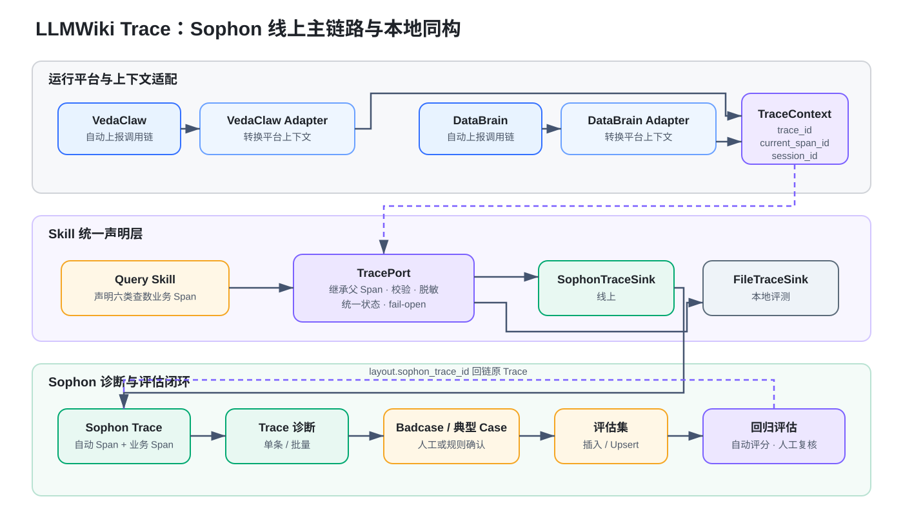

# LLMWiki Trace 技术方案｜Sophon 线上主链路与本地评测

> **方案结论：**不新建线上 Trace 平台，也不以平台私有字段定义查数业务模型。LLMWiki 使用精简、平台中立的 Trace Core 与 Data Query Profile；线上只接 Sophon，VedaClaw、DataBrain 自动上报调用链，并通过各自的 Host Adapter 向 Skill 注入当前 Trace 上下文。查数 Skill 经 TracePort 补充自定义业务 Span，本地由 FileTraceSink 投影同一份业务语义。Fornax 不进入本方案实现路径。

## 1. 背景与结论

LLMWiki 查数/找数 Skill 同时运行于线上平台和本地评测环境。目标线上形态是 VedaClaw、DataBrain 均接入 Sophon：平台自动采集模型、工具及框架调用，查数 Skill 只补充平台无法自动判断的业务决策，例如问题如何拆解、为什么召回某个资产、候选如何排序、路由为何如此选择，以及最终答案依赖哪些证据。

本方案不把 Sophon 原生字段直接当作领域模型。Trace Core 只定义稳定的调用树结构，Sophon 字段差异由 Adapter 处理；Data Query Profile 定义查数业务需要声明的语义；TracePort 为 Skill 提供统一接口；环境差异只体现在 Host Adapter 和 Sink。

### 1.1 已确认的方案决策

| 事项 | 决策 |
| --- | --- |
| 线上 Trace 平台 | 只接 Sophon，不建设 FornaxTraceSink。即使上游平台内部双写，LLMWiki 也只依赖 Sophon。 |
| 自动调用链 | 由 VedaClaw、DataBrain 自动上报 Sophon。 |
| 业务语义 | 要求两个平台支持在当前 Sophon Trace 下创建自定义业务 Span。 |
| 上下文注入 | 向两个平台提出需求：向 Skill 注入当前 `trace_id`、`span_id`、`session_id`。 |
| 父子关系 | 业务 Span 必须挂在当前 Sophon Trace/Span 下，不创建孤立根 Trace。 |
| 平台差异 | VedaClaw、DataBrain 可以各自实现 Host Adapter，但必须向 Skill 暴露同一套 TracePort 契约。 |
| 本地评测 | 使用 FileTraceSink 投影同一份业务语义，支持复查、校验、Viewer 和 Trace Diff。 |

### 1.2 目标与非目标

**目标。**把平台自动采集的客观调用事实和 Skill 主动声明的业务决策放进同一棵 Sophon 调用树；保持本地与线上业务语义一致；让 Trace 能继续进入诊断、Badcase、评估集和回归评估闭环。

**非目标。**不复制 Sophon 的存储、查询和诊断平台；不在 Prompt 中直接拼装 Sophon SDK 请求；不把评分、Badcase 标签或人工归因写入 Trace Core；不让 Trace 上报成为查数成功的业务依赖，线上始终 fail-open。

## 2. 总体架构



```mermaid
flowchart LR
  VC[VedaClaw] --> VHA[VedaClaw Host Adapter]
  DB[DataBrain] --> DHA[DataBrain Host Adapter]
  VHA -- 注入 TraceContext --> TP[TracePort]
  DHA -- 注入 TraceContext --> TP
  QS[Query Skill 业务声明] --> TP
  TP -- 线上 --> ST[SophonTraceSink]
  TP -- 本地 --> FT[FileTraceSink]
  ST --> TR[Sophon Trace]
  TR --> DG[单条 / 批量诊断]
  DG --> BC[Badcase / 典型 Case]
  BC --> DS[评估集]
  DS --> EV[自动评估 / 人工复核 / 周期回归]
  EV -. layout.sophon_trace_id .-> TR
```

### 2.1 分层职责

| 层 | 核心职责 |
| --- | --- |
| **Host Adapter** | 适配 VedaClaw、DataBrain 的运行环境，把平台上下文转换为统一 TraceContext；平台之间可以实现不同，Skill 不感知差异。 |
| **Trace Core** | 定义精简、平台中立的 Trace/Span 调用树，不承载评分和 Badcase 结论。 |
| **Data Query Profile** | 定义查数 Skill 需要补充的业务阶段、决策摘要和证据引用。 |
| **TracePort** | 提供业务 Span 的声明接口，统一完成父子关系、字段校验、脱敏、状态和 fail-open。 |
| **Trace Sink** | 线上写入当前 Sophon Trace；本地写入 FileTraceSink。二者使用相同业务语义。 |

### 2.2 线上请求主链路

1. VedaClaw 或 DataBrain 创建并自动上报 Sophon Trace。
2. 对应 Host Adapter 向 Skill 注入当前 `trace_id`、`span_id`、`session_id` 和 TracePort。
3. 平台继续自动采集 LLM、Tool、Retriever 等客观调用 Span。
4. Query Skill 在关键决策点通过 TracePort 创建自定义业务 Span。
5. SophonTraceSink 将业务 Span 挂到当前父 Span 下，形成一棵可查询的执行树。
6. 上报失败只记录诊断信息，不中断查数主链路。

## 3. Trace Core 与 Sophon 适配

### 3.1 精简 Trace Core

Trace Core 只保留重建调用树和解释执行过程所需的信息。`session_id`、`log_id`、版本、证据和业务决策都进入 Metadata，不扩展为新的 Core 字段。

| 统一字段 | 用途 |
| --- | --- |
| `trace_id` | 标识一次完整请求。 |
| `span_id / parent_span_id` | 标识结构化步骤并组织父子关系。 |
| `name / type` | 表达步骤名称，并归一为 Agent、Model、Tool、Retriever、Business 等类型。 |
| `input / output` | 保存脱敏后的输入输出或摘要，不保存查询结果明细。 |
| `start_time / duration` | 记录开始时间和耗时。 |
| `status` | 记录成功、失败、取消等统一状态。 |
| `metadata` | 承载会话、日志、版本、证据引用和业务决策等扩展信息。 |

### 3.2 Sophon Adapter 映射

| Trace Core | Sophon 可能字段 | 适配规则 |
| --- | --- | --- |
| `trace_id` | `trace_id` | 直接使用当前 Sophon Trace ID。 |
| `span_id / parent_span_id` | `span_id / parent_span_id`，或嵌套 `children` | 线上创建时继承当前父 Span；查询树形接口时可从 children 重建。 |
| `name / type` | `span_name / span_type` 或 `node_name / node_type / node_component` | Adapter 统一名称和类型枚举。 |
| `input / output` | `input / output` 或 `node_input / node_output` | 统一脱敏和摘要规则。 |
| `start_time / duration` | `start_time / cost_time` 或 `start_at / duration` | 统一时间格式和耗时单位。 |
| `status` | `status` 或 `status_code` | 归一为统一状态枚举。 |
| `metadata` | `metadata` 或 `node_meta` | 保留业务扩展字段，并执行脱敏和大小限制。 |

## 4. Data Query Profile：查数业务语义

平台自动调用链只能说明“调用了什么、是否成功、耗时多久”。Data Query Profile 补充平台无法自动推断的查数业务决策，目标是让 Badcase 可以定位到最早出现可证明偏差的阶段。

| 业务阶段 | 需要声明的信息 | 最小字段 |
| --- | --- | --- |
| 问题拆解 | 用户问题被拆成哪些时间、地区、指标、维度和约束。 | `decomposition` |
| 资产召回 | 召回了哪些数据资产，以及召回依据和证据引用。 | `recalled_assets / evidence_ref` |
| 候选生成 | 基于召回结果形成了哪些可用候选。 | `candidates` |
| 满足度排序 | 候选满足度、排序结果和主要原因。 | `ranked_candidates / reason` |
| 路由裁决 | 最终选择的查询路由及选择原因。 | `selected_route / reason` |
| SQL 生成 | 是否生成 SQL；未生成时记录原因。 | `sql_summary / no_sql_reason` |

六个阶段作为 Business Span 写入当前 Sophon Trace。SQL 执行、模型调用和工具调用复用平台自动采集的 Span，不重复上报。

**调用树示意**

```text
Trace：一次完整用户请求
└─ Root Span：Query Skill 本次运行
   ├─ Business Span：问题拆解
   │  └─ Model Span：问题理解（平台自动采集）
   ├─ Business Span：资产召回
   │  └─ Tool Span：搜索 LLMWiki（平台自动采集）
   ├─ Business Span：候选生成
   ├─ Business Span：满足度排序
   ├─ Business Span：路由裁决
   ├─ Business Span：SQL 生成
   └─ Query / Tool Span：执行 SQL（平台自动采集）
```

## 5. TracePort 与平台接入契约

### 5.1 统一 TraceContext

**最小上下文**

```text
TraceContext
- trace_id
- current_span_id
- session_id
```

VedaClaw、DataBrain 的 Host Adapter 可以不同，但都必须生成上述 TraceContext。Skill 不读取平台私有上下文，也不自行判断父 Span。

### 5.2 TracePort 最小接口

**业务 Span 声明接口**

```text
start_span(name, type="Business")
set_input(summary)
set_output(summary)
set_metadata(key, value)
finish_span(status)
```

TracePort 负责继承当前 Trace 和父 Span、字段校验、敏感信息脱敏、输入输出截断、统一状态，以及上报异常时 fail-open。Prompt 不直接生成 SDK 参数，Skill 也不依赖 Sophon 返回结果继续执行业务逻辑。

> **线上前置依赖：**VedaClaw、DataBrain 需要支持向 Skill 注入当前 Sophon TraceContext，并允许在当前 Trace 下创建自定义子 Span 和 Metadata。该能力仍处于沟通阶段；未完成联调前，只能确认平台自动调用链，不能宣称业务 Span 已接入线上。

## 6. Sophon 诊断、评估与数据回流

### 6.1 已确认的产品闭环

Sophon 已支持线上 Trace 可视化、单条和批量 Trace 诊断。诊断结果包含执行摘要、异常环节、问题归因、修复建议和可回溯证据；批量诊断可以归纳共性问题并下钻到单条 Trace。官方产品资料同时明确声明，线上 Badcase 或典型会话可以一键回流至评估集。

回流样本进入评估集后，可以选择评估工作流或自动化逻辑，进行自动评分、人工复核、重跑及周期性评估。评估记录统一通过 `layout.sophon_trace_id` 关联原始 Trace，详情页直接展示或跳转到 Sophon Trace，不手工拼接 URL。

### 6.2 自动化回流兜底

当前公开手册尚未给出“任意 Trace 直接回流”的新版 OpenAPI，也未定义统一 Badcase Schema、诊断报告读取接口和自动回流回调。若目标租户的一键回流暂未开放，Host Adapter 可将 Trace 和诊断结果映射到约定的评估集 Schema，通过评估集 OpenAPI 批量插入或 Upsert，再使用评估 OpenAPI 创建评估任务。

**自动化闭环**

```text
Sophon Trace / 诊断结果
→ 提取 query、answer、业务 Span 摘要、问题分类、trace_id
→ 脱敏、去重、映射评估集 Schema
→ batchInsertOrUpdate
→ 使用 datasetId + ids/viewId 创建评估任务
→ 自动评分 / 人工复核 / 周期回归
→ 通过 layout.sophon_trace_id 回看原 Trace
```

### 6.3 数据边界

Trace 记录执行事实和决策证据；Badcase 标签、评分、人工结论和回归状态属于评估系统。二者通过 Trace ID 关联，不把评估结果反写进 Trace Core。若需要在 Trace 页面展示评估摘要，应以外部关联或派生视图实现。

## 7. 本地评测

本地 Runner 向 Skill 注入本地 TraceContext 和同一套 TracePort，只把线上 SophonTraceSink 替换为 FileTraceSink。业务 Span 的名称、字段、父子关系和脱敏规则保持一致。

FileTraceSink 使用 append-only 事件记录事实，并生成可重建视图；本地文件用于评测复查、字段校验、Viewer 和 Trace Diff，不作为线上平台的替代品。普通运行继续 fail-open；正式评测对必填业务 Span 和结构完整性执行 fail-closed 校验。

## 8. 实施阶段

| 阶段 | 工作内容 | 完成标志 |
| --- | --- | --- |
| 阶段 0：契约确认 | 与 VedaClaw、DataBrain、Sophon 对齐上下文注入、自定义 Span、父子关系、字段限制和权限。 | 形成统一 TraceContext/TracePort 接口契约。 |
| 阶段 1：本地协议 | 实现精简 Trace Core、Data Query Profile、TracePort 和 FileTraceSink。 | 本地六阶段 Span 可重建、校验和 Diff。 |
| 阶段 2：VedaClaw 接入 | 实现 VedaClaw Host Adapter，在当前 Sophon Trace 下写入业务 Span。 | 自动 Span 与业务 Span 出现在同一棵树。 |
| 阶段 3：DataBrain 接入 | 实现 DataBrain Host Adapter，复用相同 TracePort 契约。 | Skill 代码不因运行平台变化。 |
| 阶段 4：评估回流 | 验证一键回流租户能力；必要时实现评估集 Upsert 和评估任务触发。 | Badcase 可进入评估集并回链原 Trace。 |

## 9. 验收标准

- [ ] 一次线上请求只有一条 Sophon 根 Trace，业务 Span 无孤儿节点。

- [ ] VedaClaw、DataBrain 均能注入 trace_id、current_span_id、session_id。

- [ ] 模型、工具自动 Span 与六类查数业务 Span 在同一棵调用树中可查询。

- [ ] 输入输出完成脱敏和截断，不写查询结果明细及敏感数据。

- [ ] Sophon 状态、类型和耗时字段经 Adapter 后语义一致。

- [ ] Trace 上报失败不影响查数答案，具备可观测的 fail-open 记录。

- [ ] Badcase 能进入评估集，评估记录通过 layout.sophon_trace_id 回看原 Trace。

- [ ] 本地与线上业务 Span 名称、字段和父子关系一致。

## 10. 待联调确认

- 两个平台具体采用哪套 Sophon SDK/协议，以及 Host Adapter 的责任边界。
- 当前父 Span 的注入方式和自定义子 Span 创建接口。
- Metadata 的字段、大小、脱敏、索引和查询限制。
- `cost_time / duration` 的单位及 `status / status_code` 的枚举映射。
- 目标租户是否开放“一键回流至评估集”、所需权限、字段映射和去重规则。
- 是否提供新版 Trace 回流、诊断报告读取和评估任务自动触发 OpenAPI。

## 11. 参考资料

- [Sophon AI 官方文档目录](https://bytedance.larkoffice.com/wiki/S7SFwgp0qiG12Vk0wGpcV16bnDc)
- [SophonAI OnePage](https://bytedance.larkoffice.com/wiki/ZphcwnVFkiUb9vkKakrcpJ9wnWg)
- [SophonAI 观测 OnePage](https://bytedance.larkoffice.com/wiki/PwWGwySy4i2uaTkdGlmcsqFen0d)
- [Sophon AI Trace 诊断产品操作手册](https://bytedance.larkoffice.com/wiki/H1u8w3YKqiBdNzkUAtmcGEkWnCc)
- [SophonAI 评估使用手册](https://bytedance.larkoffice.com/wiki/U1sbwMEmNi86dzk4JDPcNjYPnUe)
- [评估集相关 OpenAPI](https://bytedance.larkoffice.com/wiki/Dtuyw1aRDilAGNkII0OcxHugnjb)
- [评估相关 OpenAPI](https://bytedance.larkoffice.com/wiki/PC4gwuQrKi8QQskZvuZcy0Ienmh)
- [OpenTelemetry Traces](https://opentelemetry.io/docs/concepts/signals/traces/)
